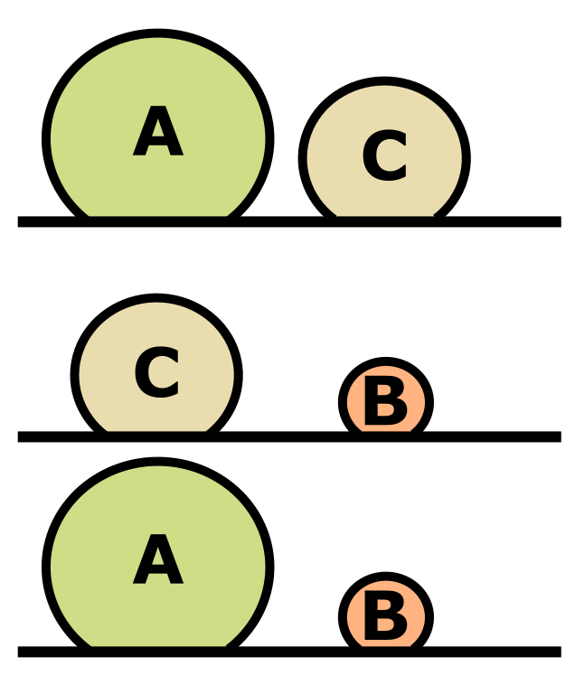

```{r setup, include=FALSE}
knitr::opts_chunk$set(echo = TRUE)
library(tidyverse)
```


<html lang="en">
  
<head>
  <title>dataSci</title>
  <meta charset="utf-8">
  <meta name="viewport" content="width=device-width, initial-scale=1">
  <link rel="stylesheet" href="https://maxcdn.bootstrapcdn.com/bootstrap/3.4.1/css/bootstrap.min.css">
  <script src="https://ajax.googleapis.com/ajax/libs/jquery/3.5.1/jquery.min.js"></script>
  <script src="https://maxcdn.bootstrapcdn.com/bootstrap/3.4.1/js/bootstrap.min.js"></script>
  <link rel="stylesheet" href="https://cdnjs.cloudflare.com/ajax/libs/font-awesome/4.7.0/css/font-awesome.min.css">
   <link rel="stylesheet" href="https://maxcdn.bootstrapcdn.com/bootstrap/3.4.1/css/bootstrap.min.css">
  <!--link rel="stylesheet" href="css/styles.css" type="text/css"-->
  <style>
  
    p, li {
      font-size: 1.5em;
    }
    
    h1{
      font-size: 2.25em;
    }
    
    h2{
      font-size: 2em;
    }
    
    
    
    .center {
      margin: 0;
      position: absolute;
      top: 50%;
      left: 50%;
      -ms-transform: translate(-50%, -50%);
      transform: translate(-50%, -50%);
    }
    
    .header {
        background-color: #FFFFFF;
        margin-bottom: 1vw;
    }
      
    .flex-container {
      display: flex;
      flex-direction: column;
      min-height: 100vh;
    }
    
    .banner-content {
      margin-top: 1vw;
      margin-left: 15vw;
      margin-right: 15vw;
    }
    
    .content {
      padding-bottom: 80px;
      margin-left: 15vw;
      margin-right: 15vw;
      flex-grow: 1;
      background-color: #FFFFFF;
    }
  
    .footer {
        background-color: #101820;
    }
      
    .fa-twitter {
      color: white;
    }
  </style>
  <meta http-equiv="Content-Type" content="text/html;charset=utf-8">
</head>


<div class = "flex-container">
  <div id = "banner" class = "header">
    <div class = "banner-content">
      <div class = "row">
        <h1>Version control: Getting started with GitHub</h1>
      </div>
        <hr>
    </div>
  </div>
  
  <div class = "content">
    

```{r include = FALSE}
# Load RCurl library:

library(RCurl)

source("https://raw.githubusercontent.com/bsevansunc/workshop_languageOfR/master/sourceCode.R")

library(knitr) ; library(kableExtra)

options(knitr.table.format = "html")

# Libraries:
library(tidyverse)

# Functions:

theme_add <- function(){
  theme(
    axis.title = element_text(size = rel(1.5))
  )
}

# Preset values

exampleFactor <- factor(c('three','two','one', 'one'))

exampleFactorLevels <- factor(
  exampleFactor,
  levels = c('one', 'two', 'three')
)

exampleFactorLabels <- factor(
  exampleFactorLevels,
  labels = c('One', 'Two', 'Three')
)

numericVector <- c(1, 1, 2, 3, 5, 8)

m <- matrix(numericVector, ncol = 2)

df <-
  as.data.frame(
    m,
    col.names = c('hello', 'world'))


really_bad_date <-
  tibble(
    month = 3,
    day = 10,
    year = 2021)

```

<h1 style="text-align: center;">Data wrangling in the tidyverse</h1>
<p style = "text-align: center; font-size: 14px;"><i>Brian S. Evans, Ph.D.</i></p>
<hr>

<h2>Introduction</h2>
<br>
<p>It is estimated that the process of summarizing and preparing data for statistical analysis, <b>data wrangling</b>, consumes roughly 80 percent of total analysis time (Dasu and Johnson 2003). Despite this, researchers are rarely given much, if any, training on properly managing their data. 

As a result, researchers in fields outside of data science rarely follow formal data management conventions and tend to format their data for a given analyis, ease of data entry, or for some now-potentially-defunct computer program. This leads to messy, inflexible datasets that are difficult to work with for anything but their initial intention.</p>

<p>The goal of this lesson is to introduce you to how to store your field data in a tidy way and how to work with tidy data. Tidy data are datasets that follow the convention of database design. This is the preferable format for data in that:</p>
<ul>
<li><b>Tidy data are not platform-specific</b>: This is not just the preferred data formatting for working in R or using <i>tidyverse</i> packages, this is the preferred format for data as a whole. Considerable research, and really an entire field of study, has gone into the rules that determine what consitutes tidy data.</li>
<li><b>Tidy data are durable and avoid data entry and modification errors</b>: Tidy data avoids generating and working with duplicate values in data tables and databases. This streamlines the data entry and management processes.</li>
<li><b>All tidy datasets are the same</b>: Tidy datasets lead to fast and flexible analysis because they are all formatted in the same way. Messy datasets can be messy in a multitude of ways and therefore may require considerable wrangling to prepare them for statistical analysis.</li>
</ul>

<br>

<hr>

<h2>Before we begin</h2>
<br>
```{r eval = FALSE}

library(tidyverse)

# Names of files we will use for this lesson:

file_names <-
  c('bird_rawCounts',
    'birdHabits',
    'dfTooLong',
    'wideFrame',
    'untidyFrame')

# Read the files from my GitHub account (a necessary evil, currently):

file_names %>% 
  purrr::map(
    ~ file.path(
      'https://raw.githubusercontent.com/bsevansunc',
      'smsc_data_science/master/data',
      str_c(., '.csv')) %>% 
      read_csv()) %>% 
  set_names(file_names) %>% 
  list2env(envir = .GlobalEnv)

# Remove file_names for a clean global environment:

rm(file_names)
```

<hr>

<h2>The rules of tidy data in the language of data science</h2>
<br>
<p>At the core of the <b>Tidyverse</b> is the notion of tidy data. Tidy data are easy to modify, summarize, model, and communicate to others. At each step in our data science process, we should be thinking about the structure of our data and taking every step we can to ensure that they are tidy.</p>

<p>The three normalization rules of database design (Codd) form the backbone of much of the field of data science and define a tidy dataset. These rules are:</p>

<ol>
<li><b>First normal</b>:
<ul>
<li>All rows represent a unique record (primary key)</li>
<li>All values are atomic</li>
<li>Columns do not contain repeated grouping</li>
</ul>
</li>
<li><b>Second normal</b>: All columns are unique to the primary key (observation)</li>
<li><b>Third normal</b>: All columns are non-transitively dependent.
<ul><li>Column values are <b>only</b> directly dependent on the column that defines the observation</ul></li>
</li>
</ol>

<p>Before proceeding to working with Tidy data, let's look at the normalization rules more in depth:</p>

<h3>The first normal rule</h3>
<ul>
<li>All rows represent a unique record (<b>primary key</b>):</li>
<br>
<p>The <b>primary key</b> is a data base field that defines a unique record in the database. Note that primary keys are rarely used in R tables, but I will use it in many of the tables of this section to illustrate the rules of database normalization.</p>

<p>The table below illustrates the measurement data for a bird that was captured on a given date. We can see that the level of observation, as shown by the primary key, defined by the bird observed (`birdID`) and date (`observationDate`). Because there are multiple records associated with this observation level, this is a violation of the first normal rule.</p>
<br>
<div class = "row">
```{r first normal start, echo = FALSE}
kable(messy1NFa, "html") %>%
  kable_styling(
    bootstrap_options = c("striped", "hover"),
    full_width = FALSE,
    font_size = 16,
    position = "float_left"
  )
```
</div>

<p>Why? Mass, wing, and tail are attributes (variables) associated with the observation of the bird and thus deserve their own columns of the table, as below.</p>
<br>
<div class = "row">
```{r tidy1NFa, echo = FALSE}
kable(tidy1NFa, "html") %>%
  kable_styling(
    bootstrap_options = c("striped", "hover"),
    full_width = FALSE,
    font_size = 16,
    position = "float_left"
  )
```
</div>
<br>
<li>All values are atomic:</li>
<br>
<p>An <b>atomic value</b> is a value that cannot be divided. In the table below, multiple dates are provided in a single column, a clear violation of this rule of the first normal.</p>
<br>
<div class = "row">
```{r badDate, echo = FALSE}
kable(badDate, "html") %>%
  kable_styling(
    bootstrap_options = c("striped", "hover"),
    full_width = FALSE,
    font_size = 16,
    position = "float_left"
  )
```
</div>

<p>To fix this, we separate date into multiple columns, as below (<i>Note: The table below is still not tidy!</i>).</p>
<br>
<div class = "row">
```{r tidy1NFb0, echo = FALSE}
kable(tidy1NFb0, "html") %>%
 kable_styling(
  bootstrap_options = c("striped", "hover"),
  full_width = FALSE,
  font_size = 16,
  position = "float_left"
  )
```
</div>
<li>Columns do not contain repeated grouping:</li>
<br>
<p>The table below contains mass measurements taken of birds on a given date. While mass is an attribute of a bird, we can see that the mass measurement varies by date.</p>
<br>
<div class = "row">
```{r messy1NFc, echo = FALSE}
kable(messy1NFc, "html") %>%
 kable_styling(
  bootstrap_options = c("striped", "hover"),
  full_width = FALSE,
  font_size = 16,
  position = "float_left"
  )
```
</div>

<p>Because the mass measurement varies by date, it is an attribute of the observation of the bird on that date. Therefore, the primary key of this table should relate to both the date of the observation and the identity of the bird observed. Each measurement, and each bird measured on a given date, is given its own row, as below.</p>
<br>
<div class = "row">
```{r tidy1NFc, echo = FALSE}
kable(exampleTidy1, "html") %>%
 kable_styling(
  bootstrap_options = c("striped", "hover"),
  full_width = FALSE,
  font_size = 16,
  position = "float_left"
  )
```
</div>
</li>
</ul>
<br>
<h3>The second normal rule</h3>
<br>
<p>The second normal rule, that all columns are unique to the observation, is a rule that can be used to test whether the values in a single table should be split into multiple tables (or, conversely, that multiple tables can be merged into a single table). This rule can be restated as "every column must be an attribute of the observation that defines the row". When working with the second normal rule, we need to ask ourselves what the level of observation is for the record. The table below contains measurements of birds taken at a given site on a given date and the proportional canopy cover (leaf cover) at the site.</p>

<br>
<div class = "row">
```{r messy second normal, echo = FALSE}
badBandingRecord <- exampleTidy1 %>%
  mutate(
    site = c('apple','apple', 'avocado', 'apple', 'avocado'),
    canopyCover = c(32.5, 32.5, 78.4, 32.5, 78.4)
  ) %>%
  select(id, birdID, observationDate, site, canopyCover, mass)

kable(badBandingRecord, "html") %>%
 kable_styling(
  bootstrap_options = c("striped", "hover"),
  full_width = FALSE,
  font_size = 16,
  position = "float_left"
  )
```
</div>

<p>Mass is an attribute of the measurement of the bird on a given date. Site is an attribute of this record, because it describes the observation. Canopy cover, however, is an attribute of site. The repeated canopy cover values is a big clue that something is awry. To deal with this, the data are split into two tables, one describing the observation and the other a table describing the site, as below.</p>
<br>
<div class = "row">
<p>Bird observation table:</p>
```{r tidy2NF_obs, echo = FALSE}
siteTable <- badBandingRecord %>%
  select(site, canopyCover) %>%
  distinct %>%
  mutate(id = siteIds) %>%
  select(id, site, canopyCover)

birdObservationTable <- badBandingRecord %>%
  select(-canopyCover) %>%
  left_join(
    siteTable %>%
      rename(siteId = id),
    by  = 'site'
  ) %>%
  select(id, siteId, birdID, observationDate, mass)

kable(birdObservationTable, "html") %>%
 kable_styling(
  bootstrap_options = c("striped", "hover"),
  full_width = FALSE,
  font_size = 16,
  position = "float_left"
  )
```
</div>
<br>
<div class = "row">
<p>Site table:</p>
```{r tidy2NF_site, echo = FALSE}
kable(siteTable %>% rename(siteId = id), "html") %>%
 kable_styling(
  bootstrap_options = c("striped", "hover"),
  full_width = FALSE,
  font_size = 16,
  position = "float_left"
  )
```
</div>
<br>
<p>In the above table the site field in the observation table has been replaced by `siteId`. This is what is called a <b>foreign key</b>. A foreign key is a field that links to the primary key in a different table. The foreign key is a way to link the two tables so that they can share information with one another. This is described as a one-to-many relationship (a row from one table can have multiple matching rows in another -- for example, there are multiple observations associated with each site).</p>

<p>There is a bit of a gray area here remaining in the observation table -- should it remain one table or split into two? Mass is certainly an attribute of the observation of a bird but, considering that multiple birds were observed at a given site, is site really an attribute of the observation? You could make a case (and I would agree) that this table should be divided even further, as below:</p>
<br>
<div class = "row">
<p>Bird observation table:</p>
```{r tidy2NFa_obs, echo = FALSE}
visitIds <- vector('character', length = 4)

for(i in seq_along(visitIds)){
  visitIds[i] <- generateObservationID()
}

visitTable <- birdObservationTable %>%
  select(siteId, observationDate) %>%
  distinct %>%
  mutate(id = visitIds) %>%
  select(id, siteId, observationDate)
  
birdObservationTable <- birdObservationTable %>%
  left_join(visitTable %>% rename(visitId = id), by = c('siteId', 'observationDate')) %>%
  select(id, visitId, birdID, mass)

kable(birdObservationTable, "html") %>%
 kable_styling(
  bootstrap_options = c("striped", "hover"),
  full_width = FALSE,
  font_size = 16,
  position = "float_left"
  )
```
</div>
<br>
<div class = "row">
<p>Visit table:</p>
```{r tidy2NFb_visit, echo = FALSE}
kable(visitTable %>% rename(visitId = id), "html") %>%
 kable_styling(
  bootstrap_options = c("striped", "hover"),
  full_width = FALSE,
  font_size = 16,
  position = "float_left"
  )
```
</div>
<br>
<div class = "row">
<p>Site table:</p>
```{r tidy2NFb_site, echo = FALSE}
kable(siteTable %>% rename(siteId = id), "html") %>%
 kable_styling(
  bootstrap_options = c("striped", "hover"),
  full_width = FALSE,
  font_size = 16,
  position = "float_left"
  )
```
</div>
<br>
<h3>The third normal rule</h3>
<br>

<p>Kent: Every non-key attribute must provide a fact about the key, the whole key, and nothing but the key. So help me Codd.</p>


<p>The third normal rule states that, in addition to first and second normal rules being met, columns cannot be <b>transitively dependent</b>. The figure on the right displays transitive dependence -- if object A is greater in size than object C and object C is larger than object B, then object A must be larger than object B. Because of the first two comparisons between objects A and C and object C and B, directly comparing objects A and B is not necessary. In the realm of data tables, if the value of some column can be directly derived from the value of any non-key column, then this column should not be included in a data table because it provides no new information.</p> 

<p>The easiest example of violations of the third normal rule, and one of the most common, is the inclusion of both a year and date field in a data table, as illustrated below.</p>
<br>
<div class = "row">
```{r tidy3messy, echo = FALSE}

badYear <- exampleTidy1 %>%
  mutate(observationYear = lubridate::year(observationDate))

kable(badYear, "html") %>%
 kable_styling(
  bootstrap_options = c("striped", "hover"),
  full_width = FALSE,
  font_size = 16,
  position = "float_left"
  )
```
</div>
<p>Because year can directly be derived from date, this column should not be included. Instead the dataset should be:
<br>
<div class = "row">
```{r tidy3clean, echo = FALSE}
kable(exampleTidy1, "html") %>%
 kable_styling(
  bootstrap_options = c("striped", "hover"),
  full_width = FALSE,
  font_size = 16,
  position = "float_left"
  )
```
</div>
<br>
<br>
<blockquote>
<h3><i class= "fa fa-user-circle-o" style = "font-size: 150%;"></i> Exercise One:</h3>
<br>
<p>Consider how to structure the following dataset using the three rules of normalizing data:</p>
```{r exercise1cleanSiteXY1, echo = FALSE}
exercise1cleanSiteXY1 <- 
  exercise1messy %>%
  separate(siteXY, into = c('x', 'y'), sep = ', ')
  
kable(exercise1messy, "html") %>%
  kable_styling(bootstrap_options = c("striped", "hover")) %>%
  row_spec(c(0, 2, 4), background = 'white') %>%
  row_spec(c(1, 3, 5), background = 'gray80')
```
<br>
</blockquote>

<br>
<hr>
<br>
<h2>The rules of tidy data in statistical language</h2>
<br>
<p>For the creation of the tidyverse, Hadley Wickham re-framed the three normalization rules into statistical language -- the language of most R users. In the statistical language, a tidy dataset has three qualities:</p>
<ol>
<li>Each variable forms a column</li>
<li>Each observation forms a row</li>
<li>Each level of observation forms a table</li>
</ol>
<p>To illustrate these rules, we will explore the process of making untidy data tidy.</p>
<br>
<h3><b>Tidy rule: Each variable forms a column</b></h3>
<br>
<h4><b>Untidy problem</b>: Multiple variables in a single column</h4>
<p>This problem relates to the first normal rule "all values are atomic". We illustrated this previously using a dataset in which there where multiple dates stored in a single date column, repeated below, with the dataset `badDate`.</p>
```{r eval = FALSE}
badDate
```
<div class = "row">
```{r separate0, echo = FALSE}
kable(badDate, "html") %>%
  kable_styling(
    bootstrap_options = c("striped", "hover"),
    full_width = FALSE,
    font_size = 16,
    position = "float_left"
  )
```
</div>
<p>This type of rule violation can easily be dealt with using the `tidyverse` <b>separate</b> function. Arguments of `separate` include:</p>
<ul>
<li><b>data</b>: The data frame that contains the columns you wish to separate</li>
<li><b>col</b>: The name of the column you wish to separate</li>
<li><b>into</b>: A vector providing the names of the new columns</li>
<li><b>sep</b>: The character that defines where to split the columns</li>
</ul>
<p>To separate the above into a tidier (but still not tidy) dataset, code the following:</p>
```{r separate}
separate(
  data = badDate,
  col = observationDate,
  into = c('date1', 'date2'),
  sep = ", "
  )
```
<br>
<h4><b>Untidy problem</b>: A single variable split into multiple columns</h4>

<p>A common mistake is to derive the value in one column using information from another column. This is a violation of the third normal rule. Above, we used the example of a dataset that included a year and date column. These columns are called <b>transitive</b> because year can be derived from date. A <b>transitive</b> variable contains no further information, so is untidy. Let's take a look at the data again, with the dataset `badYear`, before addressing the problem:</p>
<div class = "row">
```{r, eval = FALSE}
badYear
```

```{r badYear, echo = FALSE}
kable(badYear, "html") %>%
  kable_styling(
    bootstrap_options = c("striped", "hover"),
    full_width = FALSE,
    font_size = 16,
    position = "float_left"
  )
```
</div>
<br>
<p>To address this, we must <b>subset data by columns</b>. In our previous lessons we learned how to select columns from a data frame using indexing. Indexing allows us select columns based on their position within the data frame or by name:</p>
```{r}

# By position: 

badYear[,1:4]

badYear[,-5]

# By name:

badYear[, c('id', 'birdID', 'observationDate', 'mass')]

```

<br>
<p>We can use the `tidyverse` <b>select</b> function to subset a data frame by column much more easily. Arguments of `select` include the data frame that contains the columns you wish to select and the names (unquoted) or positions of the columns.</p>

```{r}

# By position: 

select(badYear, 1:4)

select(badYear, -5)

# By name:

select(badYear, id:mass)

select(badYear, -observationYear)

```
<br>
<h3><b>Tidy rule: Each observation forms a row</b></h3>
<br>
<h4><b>Untidy problem</b>: Multiple observations in a row (i.e., more than one observation per row)</h4>
<br>
<p>This type of problem is usually related to a violation of the first normalization rule (columns do not contain repeated groupings). For this problem, we will use the dataset `untidyFrame`. In this typical example a researcher is assessing the influence of a treatment measured on three test subjects:</p>
```{r, eval = FALSE}
untidyFrame
```
<div class = "row">
```{r untidyFrameTable, echo = FALSE}
kable(untidyFrame, "html") %>%
 kable_styling(
  bootstrap_options = c("striped", "hover"),
  full_width = FALSE,
  font_size = 16,
  position = "float_left"
  )
```
</div>
<p>It's easy to look at -- it's very easy to visually compare treatment A with treatment B -- but is it tidy? Nope, not at all. We would have to do some awkward wrangling in base R to get this into a tidy format. Luckily, Hadley Wickham and his team created the `tidyverse` with the aim of reshaping messy datasets like these into tidy ones.</p>

<p>With the function `gather`, we can collapse multiple columns into "key-value pairs". In the above example, we are interested in the treatment "values" for each of our "key" values. To do so, we provide:</p>

<ul>
<li>The data frame ("untidyFrame") we will be reshaping</li>
<li>The name of the new "key" field for which we are gathering the data ("treatment")</li>
<li>The name of the new "value" field where the values for that field will be stored</li>
<li>The columns for which the values will be restructured (these may be referred to by name or column number)</li>
</ul>

```{r gather, eval = FALSE}
gather(
  data = untidyFrame,
  key = treatment,
  value = value,
  treatmentA:treatmentB
  )
```

<div class = "row">
```{r gatherTable, echo = FALSE}
gatherTable <- 
  gather(
    data = untidyFrame,
    key = treatment,
    value = value,
    treatmentA:treatmentB
  )

kable(gatherTable, "html") %>%
 kable_styling(
  bootstrap_options = c("striped", "hover"),
  full_width = FALSE,
  font_size = 16,
  position = "float_left"
  )
```
</div>

<p>Let's give another example (and a more bird-y one at that). I collected bird point count data from sites in Washington, D.C. For each bird, I calculated the distance between myself and the observed birds, in units of 10 meters. On my datasheet I recorded the following:</p>
<br>
<div class = "row">
```{r, eval = T, echo=F, warning=FALSE}
kable(wideFrame, "html") %>%
  kable_styling(
  bootstrap_options = c("striped", "hover"),
  full_width = FALSE,
  font_size = 16,
  position = "float_left"
  )
```
</div>

<p>In the above, each observation is of a given species at a given distance class. The grouping of the distance columns is a clear sign that these data are not in tidy format. In the language of the tidyverse, I have split one variable (the count of birds) into multiple columns. As such, we are compelled to tidy our data by collapsing the distances into a single column. In the script below we use the `tidyr` function `gather` as:

```{r gatherCounts}
gather(data = wideFrame, 
  key = distance,
  value = obs, 
  d10:d30)
```

<p>This generated what is often called a "<b>long</b>" data frame. Are all tidy data frames long? Not necessarily! It depends on the observational unit of your study.</p>
<br>
<h4><b>Untidy problem</b>: Multiple rows per observation</h4>

<p>Take a moment to consider the following data frame of bird measurement data that we used in the first section (`dfTooLong`):</p>

```{r, eval = FALSE}
dfTooLong
```

<div class = "row">
```{r untidy HW2a, echo = FALSE, warning = FALSE}
kable(dfTooLong, "html") %>%
  kable_styling(
  bootstrap_options = c("striped", "hover"),
  full_width = FALSE,
  font_size = 16,
  position = "float_left"
  )
```
</div>

<p>In this instance the measurements (mass, tail, and wing) are all attributes associated with the level of observation, the bird on a given date, but the observation has been split into one row for each value. This is a violation of the first normal rule (all rows represent a unique record). To fix this, we must convert from long to wide form. To do so, we use the `spread` function in `tidyr`. <i>Note that usage of the key-value pair is essentially the opposite of the usage within the gather function!</i> The arguments for `spread` include:</p>
<ul>
<li>data: The data frame ("dfTooLong") we will be reshaping</li>
<li>key: The name of the "key" field to be used as column names ("measurement")</li>
<li>value: The name of the "value" field which will be distributed into the columns</li>
<li>fill: If no match is found, the value to fill (e.g., NA or 0 -- the default is NA)</li>
</ul>

```{r spread}
spread(
  data = dfTooLong,
  key = measurement,
  value = value,
  fill = NA
  )
```
<br>
<h3><b>Tidy rule: Each level of observation forms a table</b></h3>
<br>
<h4><b>Untidy problem</b>: Multiple levels of observation in a table</h4>

<p>This problem, which is a violation of the second normal rule, occurs when a single table is created to store data collected across multiple observational levels. It is probably the most common issue in data management. Let's look once again at the data table that violated the second normal rule above (`badBandingRecord`):</p>

```{r, eval = FALSE}
badBandingRecord
```
<div class = "row">
```{r badBandingRecordTable, echo = FALSE, warning = FALSE}
kable(badBandingRecord, "html") %>%
  kable_styling(
  bootstrap_options = c("striped", "hover"),
  full_width = FALSE,
  font_size = 16,
  position = "float_left"
  )
```
</div>
<p>To re-iterate, the table above contains:</p>
<ul>
<li>Site-level observations: Canopy cover is an attribute of the site</li>
<li>Bird-level observations: birdID, observationDate, site, and mass are all attributes of a bird's capture event</li>
</ul>

<p>Above we used the function `select` to remove columns from tables. We can use this function to restructure the banding record into two data frames representing two levels of observations (Note: I am using two levels to avoid the primary and foreign keys here, for simplicity):</p>

```{r}
birdRecord <- 
  select(
    badBandingRecord,
    birdID,
    observationDate,
    site,
    mass)

siteRecord <-
  select(
    badBandingRecord,
    site,
    canopyCover)

birdRecord

siteRecord
```

<p>The above is a great start, but notice that the `siteRecord` table has duplicate rows. This is a violation of the first normal rule. You can use the tidyverse function <b>distinct</b> to remove any rows that are exact duplicates of one another. The our purposes here, only relevant argument of `distinct` is the data frame. Let's use distinct to remove duplicate site records:</p>

```{r}
distinct(siteRecord)
```

<br>
<blockquote>
<h3><i class= "fa fa-user-circle-o" style = "font-size: 150%;"></i> Exercise Two:</h3>
<br>
<p>The dataset `birdCounts` is located in your global environment. Following the rules outlined above, convert this dataset to tidy-formatted data.</p>
<br>
</blockquote>
<br>
      
  </div>
  </div>
  <div class = "footer">
    <div class= "container" style = "height: 10vh;">
      <p style = "color: white; float: left; padding-top: 3vh;">Contact me:</p>
        <a href="mailto:evansbr@si.edu" class="fa fa-envelope fa-2x" target="_blank" style = "float: left; height: 7vh; padding-top: 3vh;  padding-left: 2vw;"></a>
        <a href="https://twitter.com/bsevans_unc" class="fa fa-twitter fa-2x" target="_blank" style = "float: left; height: 7vh; padding-top: 3vh; padding-left: 2vw; "></a>
      
    </div>
  </div>
</div>
