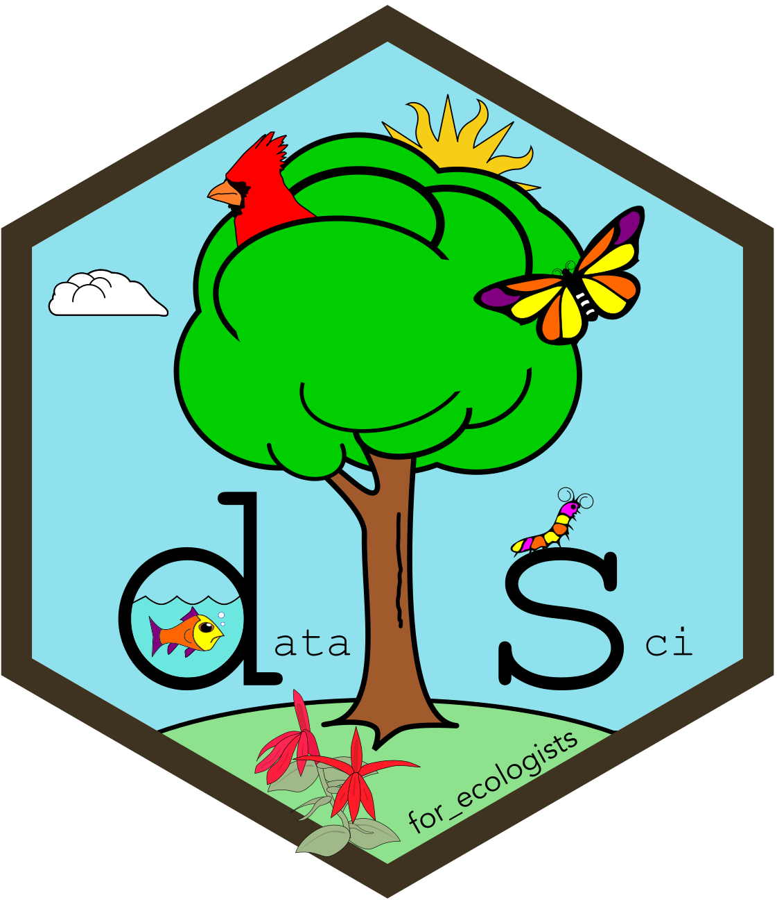

```{r setup, include=FALSE}
library(learnr)
library(lubridate)
library(RCurl)
library(lubridate)
library(tidyverse)

knitr::opts_chunk$set(echo = FALSE)


fractured_fruit <-
  tibble(
    fruit_prefix = fruit[1:3] %>%
      str_sub(1,3), 
    fruit_suffix = fruit[1:3] %>%
      str_sub(start =  4),
    fruit_type = c('pome', 'drupe', 'berry'),
    consumption_class = c('clean', 'sloppy', 'sloppy'))

long_trees <-
  tibble(
    tree_id = 1:5,
    species = c('Carya glabra', 'Quercus rubra', 'Carya glabra', 'Acer saccharum', 'Acer saccharum'),
    dbh = c(8, 32, 27, 24, 42),
    height = c(9, 23, 24, 18, 26)) %>% 
  pivot_longer(dbh:height, names_to = 'measure', values_to = 'value')

addresses <-
  tibble(
    name_last = c('Bonacci', 'Wickham', 'MacArthur', 'Euler'),
    name_first = c('Leonardo', 'Hadley', 'Robert', 'Leonhard'),
    address = 
      c('2358 Rabbit Lane ,Pisa,Italy',
        '2014 Tidy Cat Boulevard,Aukland, New Zealand',
        '1958 Warbler Court, Princeton,New Jersey',
        '7 Bridges Path,Konigsberg,Russia')) %>% 
  arrange(name_last)

my_covid_garden_sites <-
  tibble(
    bed = 1:5,
    light_access = c('full sun', 'full sun' , 'partial shade', 'full sun', 'shade'),
    plants = c('jalepenos', 'tomatoes', 'kale', 'summer squash', 'mesclun'))

my_covid_garden_events <-
  tribble(
    ~bed, ~date, ~event,
    1, '2020-04-12', 'planted',
    1, '2020-05-17', 'weeded',
    1, '2020-07-16', 'fenced',
    1, '2020-09-23', 'harvested',
    2, '2020-04-14', 'planted',
    2, '2020-05-12', 'weeded',
    2, '2020-07-14', 'eaten by deer',
    3, '2020-04-16', 'planted',
    3, '2020-05-26', 'weeded',
    3, '2020-06-23', 'eaten by slugs',
    3, '2020-07-12', 'applied diatomaceous earth',
    3, '2020-08-07', 'harvested',
    4, '2020-04-17', 'planted',
    4, '2020-05-12', 'weeded',
    4, '2020-07-14', 'trampled by deer',
    5, '2020-04-03', 'planted',
    5, '2020-05-19', 'weeded',
    5, '2020-05-20', 'eaten by squirrels') %>% 
  arrange(date) %>% 
  mutate(date = as_date(date))

my_covid_garden <-
  left_join(
    my_covid_garden_sites,
    my_covid_garden_events,
    by = 'bed')

rm(my_covid_garden_sites)

rm(my_covid_garden_events)


urban_sites <-
  read_csv('data/sites.csv')

messy_weather <-
  read_csv('data/messy_weather.csv')

messy_weather_long_days <-
  pivot_longer(
    data = messy_weather,
    cols = march_1:march_31,
    names_to = "day",
    values_to = "value",
    names_prefix = "march_")

messy_weather_date_fix <-
  unite(
    messy_weather_long_days,
    col = 'date',
    c('year', 'month', 'day'),
    sep = '-')

messy_weather_wide_weather <-
  messy_weather_date_fix %>% 
  pivot_wider(
    names_from = variable,
    values_from = value)

messy_weather_temperature_fix <-
  separate(
    messy_weather_wide_weather,
    col = temperature_min_max,
    into = c('temperature_min', 'temperature_max'),
    sep = ':')

weather_stations <-
  distinct(
    select(
      messy_weather_temperature_fix,
      station:name))

observations <-
  select(
    messy_weather_temperature_fix,
    station, date:temperature_max)

monarch_inat <-
  read_csv('data/monarch_inat.csv')

multiply_by_two <- 
  function(x) {
    x*2
  }

add_one <- 
  function(x) {
    x+1
  }

messy_weather_temperature_fix <-
  messy_weather %>% 
  pivot_longer(
    cols = march_1:march_31, 
    names_to = 'day', 
    values_to = 'value', 
    names_prefix = 'march_') %>% 
  unite(
    c('year', 'month', 'day'), 
    col = 'date', 
    sep = '-',
    na.rm = TRUE) %>% 
  pivot_wider(
    names_from = variable, 
    values_from = value) %>% 
  separate(
    col = temperature_min_max,
    into = c('temperature_min', 'temperature_max'),
    sep = ':')


weather_stations <-
  messy_weather_temperature_fix %>% 
  select(station:name) %>% 
  distinct()

observations <-
  messy_weather_temperature_fix %>% 
  select(station, date:temperature_max)
```


<head>

<link rel="stylesheet" href="https://cdnjs.cloudflare.com/ajax/libs/font-awesome/4.7.0/css/font-awesome.min.css">
<link rel="stylesheet" type="text/css" href="css/styles.css">
<link rel="icon" 
      type="image/png" 
      href = "www/hex_icon.png" />
<!-- link rel="stylesheet" href="https://maxcdn.bootstrapcdn.com/bootstrap/3.3.7/css/bootstrap.min.css" -->
<style>

body {
  font-size: 18px;
}

.topic {
  font-size: 19px !important;
}

code {
  font-size: 16px !important;
}

h1 {
  font-size: 2.25em;
}

h2 {
  font-size: 2em;
}

h3 {
  font-size: 1.75em;
}

h4 {
  font-size: 1.5em;
}

h5 {
  font-size: 1.25em;
}

pre {
  font-size: 16px !important;
  margin-top: 2em;
  margin-bottom: 2em;
}


ul{
margin-left: 2em;
}

/* Accordian style */
.accordion {
  background-color: #e6f0ff;
  color: #000000;
  cursor: pointer;
  padding: 18px;
  width: 100%;
  border-style: solid;
  border-width: 2px;
  border-color: #ffffff;
  text-align: left;
  outline: none;
  font-size: 15px;
  transition: 0.4s;
}

.active, .accordion:hover {
  background-color: #80b3ff; 
  color: #ffffff;
  font-weight: bold;
}

.panel {
  padding: 0 18px;
  display: none;
  background-color: white;
  overflow: hidden;
}
</style>
</head>

## Overview

<div class = "row">

<a title = "Data Science hex">
  
  </img>
</a>

<div style = "margin-left: 1em;">
Using **projects** in R Studio really enhances your workflow and increase the ease with which you can communicate code with others (and yourself!).

In this lesson we will create a project in R Studio. While this document will cover much of the same material as *Lecture 2, Project and script organization with R Studio*, be sure to watch that video as well. The material covered here will not include many of the tips and tricks that you will learn in that video. Also, please be sure to complete *Lecture 1, Review of R programming basics* and *Lecture 3, Reading and writing data* prior to starting this lesson, as some of the material covered there may build on that information.
</div>

Material covered in this lesson will include:

* Setting your global options
* Creating a project
* Structuring your project
* Reading and writing project data
* Using packrat
* Working with source files

</div>


<hr>

## Reference material

Here is some handy reference material that you can refer to throughout this lesson:

<div>
<button class="accordion">R Studio panes</button>
<div class="panel">
<br>
Throughout this class, I will refer to the panes (sections) of the R Studio window. This graphic should help you remember them:
<br>
</div>
</div>

<div style =  "margin-bottom: 2em;">
<button class="accordion">Keyboard shortcuts</button>
<div class="panel">
<br>
The Keyboard shortcuts we will use in this lesson are listed below for Windows and Mac operating systems.

### Windows
* View all keyboard shortcuts: Ctrl + Alt + K
* Execute code: Ctrl + Enter
* Add assignment operator: Alt + dash
* Add a new code section: Ctrl + shift + R
* Save file: Ctrl + S
* Copy: Ctrl + C
* Paste: Ctrl + V

### Mac
* View all keyboard shortcuts: Command + option + K
* Execute code: Command + Enter
* Add assignment operator: Option + dash
* Add a new code section: Command + shift + R
* Save file: Command + S
* Copy: Command + C
* Paste: Command + V

<hr>

<i class="fa fa-user-secret" aria-hidden="true" style = "font-size: 150%; padding-right: 5px;"></i>I strongly suggest using a keyboard shortcut whenever possible. It can be hard to do at first, using your mouse to click a button or typing a few characters is initially **way** easier than remembering the keyboard shortcut. If you force yourself to do it though, you won't regret it -- it saves a lot of time in the end.
</div>
</div>

<div style =  "margin-bottom: 2em;">
<button class="accordion">Glossary of terms</button>
<div class="panel">
<br>
Throughout this lesson, I will use terminology (i.e., jargon) that may be new to you. This menu item can be clicked at any point if you an encounter a term that you do not know or understand. Be sure to visit this menu for each lesson, because new items will be added (Never removed) as the course content expands.

* **Session**: Everything you do in RStudio in a single sitting.
* **Menu bar**: The bar at the top of the RStudio window
* **Pane**: The RStudio window is divided into four sections, called panes.
* **Tab**: Each pane has a tab on the top of it. For example, I will often refer to the Environment or History tabs of the workspace pane.
* <i class="fa fa-user-secret" aria-hidden="true" style = "font-size: 125%; padding-right: 5px;"></i>: Any time you see this icon (which is the *font-awesome* icon user secret), it mean that there is a tip that you should pay attention to that will improve your data science workflow.
<br>
</div>
</div>

## Getting started

I like to do any necessary housekeeping at the beginning of each session. This means that everything I do in my current session is dedicated, in its entirety, to the task at hand. That really helps organize your workflow during a given session.

<hr>

### Setting your global options


## Create a project


## Project structure


## Packrat


## Reading and writing


## Working with source files


## Delete me

### Review: Tidy data

#### Codd's rules for normalizing data:

The three normalization rules of database design (Codd) form the basis of tidy data structures. These rules are:

1. **First normal**
    - All rows represent a unique record (primary key)
    - All values are atomic
    - Columns do not contain repeated grouping
1. **Second normal**: All columns are functionally dependent the primary key (observation)
1. **Third normal**: All columns are non-transitively dependent. This means that column values are <b>only</b> directly a function of the primary key.

#### Tidy data rules

Hadley re-wrote the rules, describing tidy data as a dataset in which:

1. Each variable forms a column
1. Each observation forms a row
1. Each level of observation forms a table

We 

<hr>


<script>
var acc = document.getElementsByClassName("accordion");
var i;

for (i = 0; i < acc.length; i++) {
  acc[i].addEventListener("click", function() {
    this.classList.toggle("active");
    var panel = this.nextElementSibling;
    if (panel.style.display === "block") {
      panel.style.display = "none";
    } else {
      panel.style.display = "block";
    }
  });
}
</script>