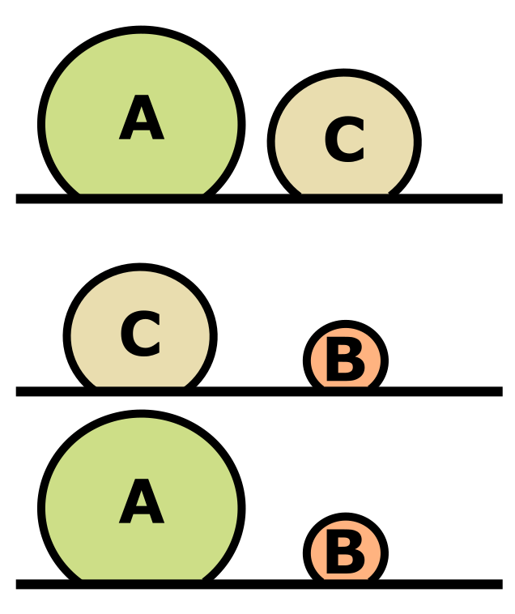

---
output:
 html_document:
  theme: yeti
---

<head>
<link rel="stylesheet" href="https://cdnjs.cloudflare.com/ajax/libs/font-awesome/4.7.0/css/font-awesome.min.css">
</head>

<style>

code{
  background-color:#f2f2f2;
  border-radius: 25px;
}
 
span.co{
  color:#000080;
  font-weight: bold;
}
 
img{
  display: block;
  padding-left: 15px;
  padding-right: 15px;
  padding-top: 10px;
  padding-bottom: 10px;
}

h4{
  text-align: left;
  font-size: 20px;
}

p{
  text-align: left;
  font-size: 16px;
}

ul, ol{
  line-height: 27px;
  text-align: left;
  font-size: 16px;
  margin-left: 0px;
}
 
blockquote{
  font-size: 18px;
  border-left: 8px solid #292093;
  background-color: #e6ffff;
  padding-left: 16px;
  padding-right: 16px;
}
 
.row{
  margin: auto;
}
 
table {
  border-collapse: collapse;
}

table, td, th {
  border: 1px solid black;
  padding: 5px;
  text-align: center;
  vertical-align: middle;
}
 
 /* Create two equal columns that floats next to each other */
.column {
  float: left;
  width: 50%;
  padding: 10px;
}

/* Clear floats after the columns */
.row:after {
  content: "";
  display: table;
  clear: both;
}

.roundBorder {
  border-radius: 25px;
  border: 5px solid #30288C;
  background: #D6EAF8;
  padding-left: 20px;
  padding-right: 20px;
  padding-top: 10px;
  padding-bottom: 10px;
}

.roundBorderBlack {
  border-radius: 25px;
  border: 10px solid #D3D3D3;
  padding-left: 20px;
  padding-right: 20px;
  padding-top: 10px;
  padding-bottom: 10px;
}

.roundBorderBlackEx {
  border-radius: 5px;
  border: 5px solid #D3D3D3;
  padding-left: 5px;
  padding-right: 5px;
  padding-top: 2px;
}

.roundBorderEx {
  border-radius: 3px;
  border: 5px solid #30288C;
  background: #D6EAF8;
  padding-left: 5px;
  padding-right: 5px;
  padding-top: 2px;
}

.tt {
    position: relative;
    display: inline-block;
    class: inline; 
    font-weight: bold;
    font-family: "Avenir";
    font-size: 18px;
    border-bottom: 1px black;
}

/* Tooltip text */
.tt .ttText {
    visibility: hidden;
    font-weight: normal;
    font-size: 18px;
    width: 200px;
    background-color: black;
    border: 1px solid black;
    color: white;
    text-align: left;
    padding: 5px;
    border-radius: 6px;
    position: absolute;
    z-index: 1;
}

/* Show the tooltip text when you mouse over the tooltip container */
.tt:hover .ttText {
    visibility: visible;
}

</style>

```{r, eval = TRUE, include  = FALSE}
# Load RCurl library:

library(RCurl)

source("https://raw.githubusercontent.com/bsevansunc/workshop_languageOfR/master/sourceCode.R")

library(knitr) ; library(kableExtra)

options(knitr.table.format = "html")
```


<h1 style="text-align: center;">Data wrangling in the tidyverse</h1>
<p style = "text-align: center; font-size: 14px;"><i>Brian S. Evans, Ph.D.</i></p>
<hr>

<h2>Introduction</h2>
<br>
<p>It is estimated that the process of summarizing and preparing data for statistical analysis, <b>data wrangling</b>, consumes roughly 80 percent of total analysis time (Dasu and Johnson 2003). Despite this, researchers are rarely given much, if any, training on properly managing their data. 

As a result, researchers in fields outside of data science rarely follow formal data management conventions and tend to format their data for a given analyis, ease of data entry, or for some now-potentially-defunct computer program. This leads to messy, inflexible datasets that are difficult to work with for anything but their initial intention.</p>

<p>The goal of this lesson is to introduce you to how to store your field data in a tidy way and how to work with tidy data. Tidy data are datasets that follow the convention of database design. This is the preferable format for data in that:</p>
<ul>
<li><b>Tidy data are not platform-specific</b>: This is not just the preferred data formatting for working in R or using <i>tidyverse</i> packages, this is the preferred format for data as a whole. Considerable research, and really an entire field of study, has gone into the rules that determine what consitutes tidy data.</li>
<li><b>Tidy data are durable and avoid data entry and modification errors</b>: Tidy data avoids generating and working with duplicate values in data tables and databases. This streamlines the data entry and management processes.</li>
<li><b>All tidy datasets are the same</b>: Tidy datasets lead to fast and flexible analysis because they are all formatted in the same way. Messy datasets can be messy in a multitude of ways and therefore may require considerable wrangling to prepare them for statistical analysis.</li>
</ul>

<br>

<hr>

<h2>Before we begin</h2>
<br>
```{r, eval=FALSE}
# Load packages:

library(tidyverse)
```

<p>Write a function that will read in data from github!</p>

```{r, eval=FALSE}
# Reading location:

gitUrl <-
  'https://raw.githubusercontent.com/bsevansunc/'

courseData <-
  'smsc_data_science/master/data/'

readDir <-
  paste0(
    gitUrl, 
    courseData
  )

# A github reading function!

gitRead <- 
  function(csvFile, readDir){
    read_csv(
      paste0(readDir, csvFile))
  }

# Load data for this lesson:

birdCounts <- gitRead('bird_rawCounts.csv', readDir)

birdHabits <- gitRead('birdHabits.csv', readDir)

dfTooLong <- gitRead('dfTooLong.csv', readDir)

wideFrame <- gitRead('wideFrame.csv', readDir)

untidyFrame <- gitRead('untidyFrame.csv', readDir)

```

<hr>

<h2>The rules of tidy data in the language of data science</h2>
<br>
<p>At the core of the <b>Tidyverse</b> is the notion of tidy data. Tidy data are easy to modify, summarize, model, and communicate to others. At each step in our data science process, we should be thinking about the structure of our data and taking every step we can to ensure that they are tidy.</p>

<p>The three normalization rules of database design (Codd) form the backbone of much of the field of data science and define a tidy dataset. These rules are:</p>

<ol>
<li><b>First normal</b>:
<ul>
<li>All rows represent a unique record (primary key)</li>
<li>All values are atomic</li>
<li>Columns do not contain repeated grouping</li>
</ul>
</li>
<li><b>Second normal</b>: All columns are unique to the primary key (observation)</li>
<li><b>Third normal</b>: All columns are non-transitively dependent.
<ul><li>Column values are <b>only</b> directly dependent on the column that defines the observation</ul></li>
</li>
</ol>

<p>Before proceeding to working with Tidy data, let's look at the normalization rules more in depth:</p>

<h3>The first normal rule</h3>
<ul>
<li>All rows represent a unique record (<b>primary key</b>):</li>
<br>
<p>The <b>primary key</b> is a data base field that defines a unique record in the database. Note that primary keys are rarely used in R tables, but I will use it in many of the tables of this section to illustrate the rules of database normalization.</p>

<p>The table below illustrates the measurement data for a bird that was captured on a given date. We can see that the level of observation, as shown by the primary key, defined by the bird observed (`birdID`) and date (`observationDate`). Because there are multiple records associated with this observation level, this is a violation of the first normal rule.</p>
<br>
<div class = "row">
```{r first normal start, echo = FALSE}
kable(messy1NFa, "html") %>%
  kable_styling(
    bootstrap_options = c("striped", "hover"),
    full_width = FALSE,
    font_size = 16,
    position = "float_left"
  )
```
</div>

<p>Why? Mass, wing, and tail are attributes (variables) associated with the observation of the bird and thus deserve their own columns of the table, as below.</p>
<br>
<div class = "row">
```{r tidy1NFa, echo = FALSE}
kable(tidy1NFa, "html") %>%
  kable_styling(
    bootstrap_options = c("striped", "hover"),
    full_width = FALSE,
    font_size = 16,
    position = "float_left"
  )
```
</div>
<br>
<li>All values are atomic:</li>
<br>
<p>An <b>atomic value</b> is a value that cannot be divided. In the table below, multiple dates are provided in a single column, a clear violation of this rule of the first normal.</p>
<br>
<div class = "row">
```{r badDate, echo = FALSE}
kable(badDate, "html") %>%
  kable_styling(
    bootstrap_options = c("striped", "hover"),
    full_width = FALSE,
    font_size = 16,
    position = "float_left"
  )
```
</div>
<p>To fix this, we separate date into multiple columns, as below (<i>Note: The table below is still not tidy!</i>).</p>
<br>
<div class = "row">
```{r tidy1NFb0, echo = FALSE}
kable(tidy1NFb0, "html") %>%
 kable_styling(
  bootstrap_options = c("striped", "hover"),
  full_width = FALSE,
  font_size = 16,
  position = "float_left"
  )
```
</div>
<li>Columns do not contain repeated grouping:</li>
<br>
<p>The table below contains mass measurements taken of birds on a given date. While mass is an attribute of a bird, we can see that the mass measurement varies by date.</p>
<br>
<div class = "row">
```{r messy1NFc, echo = FALSE}
kable(messy1NFc, "html") %>%
 kable_styling(
  bootstrap_options = c("striped", "hover"),
  full_width = FALSE,
  font_size = 16,
  position = "float_left"
  )
```
</div>

<p>Because the mass measurement varies by date, it is an attribute of the observation of the bird on that date. Therefore, the primary key of this table should relate to both the date of the observation and the identity of the bird observed. Each measurement, and each bird measured on a given date, is given its own row, as below.</p>
<br>
<div class = "row">
```{r tidy1NFc, echo = FALSE}
kable(exampleTidy1, "html") %>%
 kable_styling(
  bootstrap_options = c("striped", "hover"),
  full_width = FALSE,
  font_size = 16,
  position = "float_left"
  )
```
</div>
</li>
</ul>
<br>
<h3>The second normal rule</h3>
<br>
<p>The second normal rule, that all columns are unique to the observation, is a rule that can be used to test whether the values in a single table should be split into multiple tables (or, conversely, that multiple tables can be merged into a single table). This rule can be restated as "every column must be an attribute of the observation that defines the row". When working with the second normal rule, we need to ask ourselves what the level of observation is for the record. The table below contains measurements of birds taken at a given site on a given date and the proportional canopy cover (leaf cover) at the site.</p>

<br>
<div class = "row">
```{r messy second normal, echo = FALSE}
badBandingRecord <- exampleTidy1 %>%
  mutate(
    site = c('apple','apple', 'avocado', 'apple', 'avocado'),
    canopyCover = c(32.5, 32.5, 78.4, 32.5, 78.4)
  ) %>%
  select(id, birdID, observationDate, site, canopyCover, mass)

kable(badBandingRecord, "html") %>%
 kable_styling(
  bootstrap_options = c("striped", "hover"),
  full_width = FALSE,
  font_size = 16,
  position = "float_left"
  )
```
</div>

<p>Mass is an attribute of the measurement of the bird on a given date. Site is an attribute of this record, because it describes the observation. Canopy cover, however, is an attribute of site. The repeated canopy cover values is a big clue that something is awry. To deal with this, the data are split into two tables, one describing the observation and the other a table describing the site, as below.</p>
<br>
<div class = "row">
<p>Bird observation table:</p>
```{r tidy2NF_obs, echo = FALSE}
siteTable <- badBandingRecord %>%
  select(site, canopyCover) %>%
  distinct %>%
  mutate(id = siteIds) %>%
  select(id, site, canopyCover)

birdObservationTable <- badBandingRecord %>%
  select(-canopyCover) %>%
  left_join(
    siteTable %>%
      rename(siteId = id),
    by  = 'site'
  ) %>%
  select(id, siteId, birdID, observationDate, mass)

kable(birdObservationTable, "html") %>%
 kable_styling(
  bootstrap_options = c("striped", "hover"),
  full_width = FALSE,
  font_size = 16,
  position = "float_left"
  )
```
</div>
<br>
<div class = "row">
<p>Site table:</p>
```{r tidy2NF_site, echo = FALSE}
kable(siteTable %>% rename(siteId = id), "html") %>%
 kable_styling(
  bootstrap_options = c("striped", "hover"),
  full_width = FALSE,
  font_size = 16,
  position = "float_left"
  )
```
</div>
<br>
<p>In the above table the site field in the observation table has been replaced by `siteId`. This is what is called a <b>foreign key</b>. A foreign key is a field that links to the primary key in a different table. The foreign key is a way to link the two tables so that they can share information with one another. This is described as a one-to-many relationship (a row from one table can have multiple matching rows in another -- for example, there are multiple observations associated with each site).</p>

<p>There is a bit of a gray area here remaining in the observation table -- should it remain one table or split into two? Mass is certainly an attribute of the observation of a bird but, considering that multiple birds were observed at a given site, is site really an attribute of the observation? You could make a case (and I would agree) that this table should be divided even further, as below:</p>
<br>
<div class = "row">
<p>Bird observation table:</p>
```{r tidy2NFa_obs, echo = FALSE}
visitIds <- vector('character', length = 4)

for(i in seq_along(visitIds)){
  visitIds[i] <- generateObservationID()
}

visitTable <- birdObservationTable %>%
  select(siteId, observationDate) %>%
  distinct %>%
  mutate(id = visitIds) %>%
  select(id, siteId, observationDate)
  
birdObservationTable <- birdObservationTable %>%
  left_join(visitTable %>% rename(visitId = id), by = c('siteId', 'observationDate')) %>%
  select(id, visitId, birdID, mass)

kable(birdObservationTable, "html") %>%
 kable_styling(
  bootstrap_options = c("striped", "hover"),
  full_width = FALSE,
  font_size = 16,
  position = "float_left"
  )
```
</div>
<br>
<div class = "row">
<p>Visit table:</p>
```{r tidy2NFb_visit, echo = FALSE}
kable(visitTable %>% rename(visitId = id), "html") %>%
 kable_styling(
  bootstrap_options = c("striped", "hover"),
  full_width = FALSE,
  font_size = 16,
  position = "float_left"
  )
```
</div>
<br>
<div class = "row">
<p>Site table:</p>
```{r tidy2NFb_site, echo = FALSE}
kable(siteTable %>% rename(siteId = id), "html") %>%
 kable_styling(
  bootstrap_options = c("striped", "hover"),
  full_width = FALSE,
  font_size = 16,
  position = "float_left"
  )
```
</div>
<br>
<h3>The third normal rule</h3>
<br>

<p>Kent: Every non-key attribute must provide a fact about the key, the whole key, and nothing but the key. So help me Codd.</p>

<p>The third normal rule states that, in addition to first and second normal rules being met, columns cannot be <b>transitively dependent</b>. The figure on the right displays transitive dependence -- if object A is greater in size than object C and object C is larger than object B, then object A must be larger than object B. Because of the first two comparisons between objects A and C and object C and B, directly comparing objects A and B is not necessary. In the realm of data tables, if the value of some column can be directly derived from the value of any non-key column, then this column should not be included in a data table because it provides no new information.</p> 

<p>The easiest example of violations of the third normal rule, and one of the most common, is the inclusion of both a year and date field in a data table, as illustrated below.</p>
<br>
<div class = "row">
```{r tidy3messy, echo = FALSE}

badYear <- exampleTidy1 %>%
  mutate(observationYear = lubridate::year(observationDate))

kable(badYear, "html") %>%
 kable_styling(
  bootstrap_options = c("striped", "hover"),
  full_width = FALSE,
  font_size = 16,
  position = "float_left"
  )
```
</div>
<p>Because year can directly be derived from date, this column should not be included. Instead the dataset should be:
<br>
<div class = "row">
```{r tidy3clean, echo = FALSE}
kable(exampleTidy1, "html") %>%
 kable_styling(
  bootstrap_options = c("striped", "hover"),
  full_width = FALSE,
  font_size = 16,
  position = "float_left"
  )
```
</div>
<br>
<br>
<blockquote>
<h3><i class= "fa fa-user-circle-o" style = "font-size: 150%;"></i> Exercise One:</h3>
<br>
<p>Consider how to structure the following dataset using the three rules of normalizing data:</p>
```{r exercise1cleanSiteXY1, echo = FALSE}
exercise1cleanSiteXY1 <- 
  exercise1messy %>%
  separate(siteXY, into = c('x', 'y'), sep = ', ')
  
kable(exercise1messy, "html") %>%
  kable_styling(bootstrap_options = c("striped", "hover")) %>%
  row_spec(c(0, 2, 4), background = 'white') %>%
  row_spec(c(1, 3, 5), background = 'gray80')
```
<br>
</blockquote>

<br>
<hr>
<br>
<h2>The rules of tidy data in statistical language</h2>
<br>
<p>For the creation of the tidyverse, Hadley Wickham re-framed the three normalization rules into statistical language -- the language of most R users. In the statistical language, a tidy dataset has three qualities:</p>
<ol>
<li>Each variable forms a column</li>
<li>Each observation forms a row</li>
<li>Each level of observation forms a table</li>
</ol>
<p>To illustrate these rules, we will explore the process of making untidy data tidy.</p>
<br>
<h3><b>Tidy rule: Each variable forms a column</b></h3>
<br>
<h4><b>Untidy problem</b>: Multiple variables in a single column</h4>
<p>This problem relates to the first normal rule "all values are atomic". We illustrated this previously using a dataset in which there where multiple dates stored in a single date column, repeated below, with the dataset `badDate`.</p>
```{r eval = FALSE}
badDate
```
<div class = "row">
```{r separate0, echo = FALSE}
kable(badDate, "html") %>%
  kable_styling(
    bootstrap_options = c("striped", "hover"),
    full_width = FALSE,
    font_size = 16,
    position = "float_left"
  )
```
</div>
<p>This type of rule violation can easily be dealt with using the `tidyverse` <b>separate</b> function. Arguments of `separate` include:</p>
<ul>
<li><b>data</b>: The data frame that contains the columns you wish to separate</li>
<li><b>col</b>: The name of the column you wish to separate</li>
<li><b>into</b>: A vector providing the names of the new columns</li>
<li><b>sep</b>: The character that defines where to split the columns</li>
</ul>
<p>To separate the above into a tidier (but still not tidy) dataset, code the following:</p>
```{r separate}
separate(
  data = badDate,
  col = observationDate,
  into = c('date1', 'date2'),
  sep = ", "
  )
```
<br>
<h4><b>Untidy problem</b>: A single variable split into multiple columns</h4>

<p>A common mistake is to derive the value in one column using information from another column. This is a violation of the third normal rule. Above, we used the example of a dataset that included a year and date column. These columns are called <b>transitive</b> because year can be derived from date. A <b>transitive</b> variable contains no further information, so is untidy. Let's take a look at the data again, with the dataset `badYear`, before addressing the problem:</p>
<div class = "row">
```{r, eval = FALSE}
badYear
```

```{r badYear, echo = FALSE}
kable(badYear, "html") %>%
  kable_styling(
    bootstrap_options = c("striped", "hover"),
    full_width = FALSE,
    font_size = 16,
    position = "float_left"
  )
```
</div>
<br>
<p>To address this, we must <b>subset data by columns</b>. In our previous lessons we learned how to select columns from a data frame using indexing. Indexing allows us select columns based on their position within the data frame or by name:</p>
```{r}

# By position: 

badYear[,1:4]

badYear[,-5]

# By name:

badYear[, c('id', 'birdID', 'observationDate', 'mass')]

```

<br>
<p>We can use the `tidyverse` <b>select</b> function to subset a data frame by column much more easily. Arguments of `select` include the data frame that contains the columns you wish to select and the names (unquoted) or positions of the columns.</p>

```{r}

# By position: 

select(badYear, 1:4)

select(badYear, -5)

# By name:

select(badYear, id:mass)

select(badYear, -observationYear)

```
<br>
<h3><b>Tidy rule: Each observation forms a row</b></h3>
<br>
<h4><b>Untidy problem</b>: Multiple observations in a row (i.e., more than one observation per row)</h4>
<br>
<p>This type of problem is usually related to a violation of the first normalization rule (columns do not contain repeated groupings). For this problem, we will use the dataset `untidyFrame`. In this typical example a researcher is assessing the influence of a treatment measured on three test subjects:</p>
```{r, eval = FALSE}
untidyFrame
```
<div class = "row">
```{r untidyFrameTable, echo = FALSE}
kable(untidyFrame, "html") %>%
 kable_styling(
  bootstrap_options = c("striped", "hover"),
  full_width = FALSE,
  font_size = 16,
  position = "float_left"
  )
```
</div>
<p>It's easy to look at -- it's very easy to visually compare treatment A with treatment B -- but is it tidy? Nope, not at all. We would have to do some awkward wrangling in base R to get this into a tidy format. Luckily, Hadley Wickham and his team created the `tidyverse` with the aim of reshaping messy datasets like these into tidy ones.</p>

<p>With the function `gather`, we can collapse multiple columns into "key-value pairs". In the above example, we are interested in the treatment "values" for each of our "key" values. To do so, we provide:</p>

<ul>
<li>The data frame ("untidyFrame") we will be reshaping</li>
<li>The name of the new "key" field for which we are gathering the data ("treatment")</li>
<li>The name of the new "value" field where the values for that field will be stored</li>
<li>The columns for which the values will be restructured (these may be referred to by name or column number)</li>
</ul>

```{r gather, eval = FALSE}
gather(
  data = untidyFrame,
  key = treatment,
  value = value,
  treatmentA:treatmentB
  )
```

<div class = "row">
```{r gatherTable, echo = FALSE}
gatherTable <- 
  gather(
    data = untidyFrame,
    key = treatment,
    value = value,
    treatmentA:treatmentB
  )

kable(gatherTable, "html") %>%
 kable_styling(
  bootstrap_options = c("striped", "hover"),
  full_width = FALSE,
  font_size = 16,
  position = "float_left"
  )
```
</div>

<p>Let's give another example (and a more bird-y one at that). I collected bird point count data from sites in Washington, D.C. For each bird, I calculated the distance between myself and the observed birds, in units of 10 meters. On my datasheet I recorded the following:</p>
<br>
<div class = "row">
```{r, eval = T, echo=F, warning=FALSE}
kable(wideFrame, "html") %>%
  kable_styling(
  bootstrap_options = c("striped", "hover"),
  full_width = FALSE,
  font_size = 16,
  position = "float_left"
  )
```
</div>

<p>In the above, each observation is of a given species at a given distance class. The grouping of the distance columns is a clear sign that these data are not in tidy format. In the language of the tidyverse, I have split one variable (the count of birds) into multiple columns. As such, we are compelled to tidy our data by collapsing the distances into a single column. In the script below we use the `tidyr` function `gather` as:

```{r gatherCounts}
gather(data = wideFrame, 
  key = distance,
  value = obs, 
  d10:d30)
```

<p>This generated what is often called a "<b>long</b>" data frame. Are all tidy data frames long? Not necessarily! It depends on the observational unit of your study.</p>
<br>
<h4><b>Untidy problem</b>: Multiple rows per observation</h4>

<p>Take a moment to consider the following data frame of bird measurement data that we used in the first section (`dfTooLong`):</p>

```{r, eval = FALSE}
dfTooLong
```

<div class = "row">
```{r untidy HW2a, echo = FALSE, warning = FALSE}
kable(dfTooLong, "html") %>%
  kable_styling(
  bootstrap_options = c("striped", "hover"),
  full_width = FALSE,
  font_size = 16,
  position = "float_left"
  )
```
</div>

<p>In this instance the measurements (mass, tail, and wing) are all attributes associated with the level of observation, the bird on a given date, but the observation has been split into one row for each value. This is a violation of the first normal rule (all rows represent a unique record). To fix this, we must convert from long to wide form. To do so, we use the `spread` function in `tidyr`. <i>Note that usage of the key-value pair is essentially the opposite of the usage within the gather function!</i> The arguments for `spread` include:</p>
<ul>
<li>data: The data frame ("dfTooLong") we will be reshaping</li>
<li>key: The name of the "key" field to be used as column names ("measurement")</li>
<li>value: The name of the "value" field which will be distributed into the columns</li>
<li>fill: If no match is found, the value to fill (e.g., NA or 0 -- the default is NA)</li>
</ul>

```{r spread}
spread(
  data = dfTooLong,
  key = measurement,
  value = value,
  fill = NA
  )
```
<br>
<h3><b>Tidy rule: Each level of observation forms a table</b></h3>
<br>
<h4><b>Untidy problem</b>: Multiple levels of observation in a table</h4>

<p>This problem, which is a violation of the second normal rule, occurs when a single table is created to store data collected across multiple observational levels. It is probably the most common issue in data management. Let's look once again at the data table that violated the second normal rule above (`badBandingRecord`):</p>

```{r, eval = FALSE}
badBandingRecord
```
<div class = "row">
```{r badBandingRecordTable, echo = FALSE, warning = FALSE}
kable(badBandingRecord, "html") %>%
  kable_styling(
  bootstrap_options = c("striped", "hover"),
  full_width = FALSE,
  font_size = 16,
  position = "float_left"
  )
```
</div>
<p>To re-iterate, the table above contains:</p>
<ul>
<li>Site-level observations: Canopy cover is an attribute of the site</li>
<li>Bird-level observations: birdID, observationDate, site, and mass are all attributes of a bird's capture event</li>
</ul>

<p>Above we used the function `select` to remove columns from tables. We can use this function to restructure the banding record into two data frames representing two levels of observations (Note: I am using two levels to avoid the primary and foreign keys here, for simplicity):</p>

```{r}
birdRecord <- 
  select(
    badBandingRecord,
    birdID,
    observationDate,
    site,
    mass)

siteRecord <-
  select(
    badBandingRecord,
    site,
    canopyCover)

birdRecord

siteRecord
```

<p>The above is a great start, but notice that the `siteRecord` table has duplicate rows. This is a violation of the first normal rule. You can use the tidyverse function <b>distinct</b> to remove any rows that are exact duplicates of one another. The our purposes here, only relevant argument of `distinct` is the data frame. Let's use distinct to remove duplicate site records:</p>

```{r}
distinct(siteRecord)
```

<br>
<blockquote>
<h3><i class= "fa fa-user-circle-o" style = "font-size: 150%;"></i> Exercise Two:</h3>
<br>
<p>The dataset `birdCounts` is located in your global environment. Following the rules outlined above, convert this dataset to tidy-formatted data.</p>
<br>
</blockquote>
<br>

<h2>Working with tidy data</h2>


<h3>The nested function</h3>
<br>
<p>Like all functions, the `tidyverse` functions above can be <b>nested</b> within the other. Nesting helps avoid assigning intermediate objects -- this reduces the number of objects that are stored in your R environment. An advantage of this is that it also reduces the number of names you have to assign to objects, and, of course, the number of names that you have to remember ("What did I call that ... ?"). We've used nested functions quite a bit throughout this workshop thus far. Let's take a moment to review nested and non-nested versions of functions.</p>

<p>To illustrate nested and non-nested code-writing, we will conduct the following analysis:</p>

$$Z_{1} = [1,2,3,4,5]$$
$$Z_{2} = 2(Z_{1})$$
$$Z_{3} = Z_{2}+1$$

<p>Note that the steps in this analysis are <b>chained</b> -- each step is dependent on output from the previous step. Let's begin to evaluate these statements by first defining the values for vector Z1:</p>
```{r nested functions define z1, eval = FALSE}
# Initial values:

Z1 <- 
  1:5
```
<br>
<p>Next, let's write functions for the second and third steps of this process:</p>
```{r nested functions}
# Some very silly functions for illustration:

multiplyByTwo <- 
  function(x){
    x*2
  }

addOne <- 
  function(x){
    x+1
  }
```
<br>
<p>To carry out this chained analysis, one non-nested option is to complete the process by assigning a new object for each step. What are the advantages and disadvantages of the below?</p>
```{r nested nonnest new object}
# Non-nested, new object for each step:

z1 <- 
  1:5

z2 <-
  multiplyByTwo(z1)

addOne(z2)
```
<br>
<p>Another non-nested option is to complete the process by overwriting the origin object for each step. What are the advantages and disadvantages of the below?</p>
```{r nested nonnest overwrite object}
# Non-nested, overwrite object for each step:

z <- 
  1:5

z <- 
  multiplyByTwo(z)

addOne(z)
```
<br>
<p>We can also write the process as nested functions. What are the advantages and disadvantages of the below?</p> 
```{r nested version}
# Nested:

addOne(
  multiplyByTwo(1:5))
```
<br>
<p>Take a moment to consider the nested and non-nested versions of the process above. Each has its strengths and weaknesses:</p>
<ul>
<li><b>Non-nested with new object</b>:
<ul>
<li>Strength: Easy to read.</li>
<li>Weaknesses: Takes up a lot of script space. Includes an intermediate object assignment (`z1`) that may be hard to remember.</li>
</ul>
</li>
<li><b>Non-nested with overwritten object</b>:
<ul>
<li>Strengths: Easy to read. No new names.</li>
<li>Weaknesses: Takes up a lot of script space. Loss of the initial value of `z` (<i>never, never, never overwrite assigned objects!</i>).</li>
</ul>
</li>
<li><b>Nested</b>:
<ul>
<li>Strengths: Concise. No new names.</li>
<li>Weaknesses: It is very difficult to read -- the object of the line of code is `1:5` therefore the code is read from the inside out.</li>
</ul>
</li>
</ul>

<hr>
<h3>The pipe</h3>
<br>
<p>One of the greatest recent advancements in the world of R is the implementation of the <b>pipe operator</b>. A pipe operator allows you to set the output of one process as the input of another -- thus sequences of calculations are chained together without having to define intermediate steps as R objects (_Note: Piping is sometimes called chaining_). Piping was first implemented in R by ecologist and R guru Ben Bolker, in an answer to a question on stackoverflow.   Hadley Wickham introduced his version of piping to his `dplyr` package in 2013 while concurrently Stefan Milton Bache developed a more flexible version for his package `magrittr` (named after Magritte's painting, <i>The Treachery of Images</i>). In 2014, Wickham and Bache teamed up and Bache's pipe was incorporated into the `tidyverse`.</p>

<p>Piping makes scripts more readable and easier to write. Moreover, if you didn't do a great job naming your R objects, you may have a hard time remembering what each was. The alternative, nested functions, can be problematically complicated to read. Piping avoids the necessity to assign intermediate objects and makes scripts legible by conducting analyses in sequence.</p>

<p>To illustrate how piping works, let's look again at the nested and non-nested processes that we completed at the start of this section:</p>
```{r pipe reiterate nest}
# Non-nested, new object for each step:

z1 <- 
  1:5

z2 <- 
  multiplyByTwo(1)

addOne(z2)

# Nested:

addOne(
  multiplyByTwo(1:5))
``` 
<br>
<p>To pipe this operation, we use the pipe symbol, `%>%`,  to separate arguments. The pipe represents the word "then". In piping, the output on the left side of the pipe becomes the first argument in the function on the right. We structure our piped statement similar to that of the non-nested version: "multiply `z` by two <i>then</i> add one to this value". Piping the above, our code would read as:</p> 
```{r pipe version}
1:5 %>%
  multiplyByTwo %>%
  addOne
``` 
<br>
<p>Isn't it lovely? Like the nested code, it does not create intermediate obects, and like the non-nested versions of the code it reads from left-to-right (or top-to-bottom).</p>

<p>Notice that I used multiple indented lines of code. For maximal readibility, it is <b>highly recommended</b> that any multi-step operation should be formatted as such (this is considered <b>best management practices</b> for programmers across languages).

<p>You should consider <b>every</b> script you write to be a <b>communication</b> between you and your future self and yourself and fellow scientists. Make sure your scripts communicate clearly -- future you and your fellow scientists will appreciate it greatly!</p>

<hr>
<h3>Joining data</h3>

<p>Recall that one of the rules of tidy data states that "each level of observation forms a table". The table below displays bird banding records at a set of sites.</p> 
```{r messy2NF, echo = FALSE}
kable(messy2NF %>% slice(1:5), "html") %>%
  kable_styling(bootstrap_options = c("striped", "hover"))
```
<br>
<p>In the above, canopy cover is a condition of site-level observations rather than bird-level observations. Therefore, these sets of values should be divided into two (or more) tables.</p>
<br>
<div class = "row">
<div class = "column">
<p>Bird-level observations</p>
```{r tidy2NFa, echo = FALSE}
kable(tidy2NFobsLevel %>% slice(1:5), "html") %>%
  kable_styling(bootstrap_options = c("striped", "hover"))
```
<br>
</div>
<div class = "column">
<p>Site-level observations</p>
```{r tidy2NFb, echo = FALSE}
kable(tidy2NFsiteLevel %>% rename(siteId = id), "html") %>%
  kable_styling(bootstrap_options = c("striped", "hover"))
```
<br>
</div>
</div>
<br>
<p>The above is considerably more tidy but presents a potential problem -- how can we explore variables across tables? To address this, let's look at another example table. The table below provides bird point count and life history data.</p>
```{r messy habits, echo = FALSE}
birdCounts %>%
  left_join(birdHabits, by = 'species') %>%
  select(site, date, species, foraging, diet, count) %>%
  slice(1:10) %>%
  kable("html") %>%
  kable_styling(bootstrap_options = c("striped", "hover"))
```
<br>
<p>Note in the table above that count data are bird-level observations while life history traits are species-level observations. To address this, the data need to be separated into individual tables. These tables are provided below (showing just the first 5 records of each table).</p>
```{r tables to join}
# Tables to join:

birdCounts

birdHabits
```
<br>

<div class = "row">
<div class = "column">
<p>Bird-level observations (birdCounts)</p>
```{r birdCounts display, echo = FALSE}
kable(birdCounts %>% slice(1:5), "html") %>%
  kable_styling(bootstrap_options = c("striped", "hover"))
```
<br>
</div>
<div class = "column">
<p>Species-level observations (birdHabits)</p>
```{r birdHabits display, echo = FALSE}
kable(birdHabits %>% slice(1:5), "html") %>%
  kable_styling(bootstrap_options = c("striped", "hover"))
```
<br>
</div>
</div>

<p>To bring information from the two tables together, we use "join" operations. Below we will explore using a "left-join" but there are several joins available. See `?left_join` for more information.</p>

<p><b>left_join</b>: Join table y to table x using matching value in a column or columns.</p>
<p>
<b>x</b>: The target table</br>
<b>y</b>: The table to be joined to the target</br>
<b>by</b>: A character vector of the columns to join by
</p>
```{r left_join pipe}
# Join tables:

left_join(
  x = birdCounts, 
  y = birdHabits, 
  by = 'species')

# Join birdHabits to birdCounts using a pipe:

birdCounts %>%
  left_join(
    birdHabits, 
    by = 'species')

```
<br>
<hr>
<h3>Subsetting data</h3>
<br>
<h4>Columns</h4>
<br>
<p>Above, we used `select` to subset a data frame by column or index (column number). This is accomplished as below.</p>

<p><b>select</b>: Subset a column of a table by column name or index.</p>
```{r select indexing}
birdHabits

# Subset columns using select:

select(
  birdHabits,
  species,
  foraging)

# Select columns using a pipe:

birdHabits %>%
  select(species, foraging)

```
<br>
<h3>Rows</h3>
<br>
<h4>slice</h4>
<p>Rows can be subset by position (index) using the `slice` function, as below.</p>
```{r slice pipe}
birdHabits

# Subset rows using slice:

slice(
  birdHabits,
  1:4)

# Slice rows using a pipe:

birdHabits %>%
  slice(1:4)

```
<br>
<h4>distinct</h4>
<br>
<p>If we were interested in generating a visit table for point counts (the site visited and the date the visit occured), we can use `select` to subset the `birdCounts` frame to just those columns, as below.</p>
```{r distinct 0}
# Subset birdCounts to site and date columns:

select(
  birdCounts,
  site, 
  date)
```
<br>
```{r display table distinct 0, echo = FALSE}
kable(select(birdCounts, site, date) %>% slice(1:5), "html") %>%
  kable_styling(bootstrap_options = c("striped", "hover"))
```
<br>
<p>Doing so, however, breaks one of the <b>rules of tidy data</b> -- "Each observation forms a row". To address this, we can use the function `distinct`, which will remove duplicate records.</p>
```{r distinct pipe}
# Subset birdCounts to distinct records of site and date:

distinct(
  select(birdCounts,
         site,
         date))

# Subset to unique site and date records using a pipe:

birdCounts %>%
  select(site, date) %>%
  distinct
```
<br>

<h4>filter</h4>
<br>
<p>The `tidyverse` function `filter` allows us to filter objects to rows that satisfy logical conditions.</p>
```{r filter pipe}

# Subset rows by condition using filter:

filter(
  birdHabits,
  diet == 'omnivore')

# Filter rows using a pipe:

birdHabits %>%
  filter(diet == 'omnivore')

```
<br>
<p>Using `filter` you can apply multiple conditional filters to a data frame:</p>
```{r filter multiple}
# Subset rows by multiple conditions using filter:

filter(birdHabits,
       diet == 'omnivore',
       foraging == 'ground')

# Filter rows using a pipe:

birdHabits %>%
  filter(diet == 'omnivore',
         foraging == 'ground')

# or:

birdHabits %>%
  filter(diet == 'omnivore') %>%
  filter(foraging == 'ground')
```

<br>
<blockquote>
<h2><i class= "fa fa-user-circle-o" style = "font-size: 150%;"></i> Exercise Three:</h2>
<hr>
<p>Complete the following code to subset `birdCounts` to ground foraging birds!</p>
```{r exercise three, eval = FALSE}
# Subset birdCounts to ground foraging birds:

birdCounts %>%
  left_join(birdHabits # COMPLETE
  filter(foraging # COMPLETE
  select(s # COMPLETE  
         
```
</blockquote>
<br>

<hr>
<h3>Adding & modifying columns</h3>

<h4>mutate</h4>
<p>The function `mutate` can be used to modify an existing column or add a new one.</p>

<p>Modify an existing column:</p>
```{r mutate existing}
# Mutate species column in base R:

birdCounts

birdCounts$species <- 
  toupper(birdCounts$species)

birdCounts$species <- 
  tolower(birdCounts$species)

# Mutate species column using mutate:

mutate(
  birdCounts,
  species  = toupper(species))

# Mutate using a pipe:

birdCounts %>%
  mutate(species = toupper(species))
         
```
<br>
<p>Note in the above that the base R version actually overwrote the original species column. This is a big problem that we want to avoid at all costs.</p>

<p>To add a new column using `mutate`, you provide the new column's name:</p>
```{r mutate new pipe}
# Add a year column in base R:

birdCounts$year <- 
  year(birdCounts$date)

birdCounts

birdCounts <- birdCounts[,-5]

# Mutate year column using mutate:

mutate(
  birdCounts,
  year  = year(date))

# Mutate using a pipe:

birdCounts %>%
  mutate(year = year(date))
         
```
<br>
<p>Again, the base R version added the column to the data frame and is stored in memory. The `mutate` version is considerably safer because nothing is being overwritten.</p>


<h4>transmute</h4>

<p>The function <b>transmute</b> is similar to `mutate` in that it can be used to calculate or modify a new or existing column. If differs in that it will subset the data frame to only the specified columns (similar to select):</p>
```{r transmute pipe}
# Add a year column, subset to site and year in base R:

newFrame <- 
  data_frame(
    site = birdCounts$site,
    year = year(birdCounts$date)
  )

# Transmute to add a year column, subset to site and year:

transmute(
  birdCounts,
  site,
  year = year(date))

# Transmute using a pipe:

birdCounts %>%
  transmute(site, year = year(date))

```
<br>
<h3>Renaming columns</h3>
<h4>select and rename</h4>
<p>Finally, we may be interested in maintaining the values of a column but changing its name. To do so, we use the function `select` if we would like to subset the columns along the way or `rename` if we would like to change a name without subsetting the data frame.</p>
```{r select and rename pipe}
# Rename the species column using select:

select(
  birdCounts,
  site, 
  date, 
  spp = species, 
  count)

# Select using a pipe:

birdCounts %>%
  select(site, date, spp = species, count)

# Rename the species column using rename:

rename(
  birdCounts,
  spp = species)

# Rename the species column to spp using rename and a pipe:

birdCounts %>%
  rename(spp = species)

```

<br>
<blockquote>
<h2><i class= "fa fa-user-circle-o" style = "font-size: 150%;"></i> Exercise Four:</h2>
<hr>
<p>Filter `birdCounts` to point counts that took place in 2009.</p>
```{r exercise four, eval = FALSE}
# Subset birdCounts to point counts from 2009:

birdCounts %>%
  mutate(year # COMPLETE
  filter(year # COMPLETE
```
<br>
</blockquote>
<br>
<hr>
<br>


