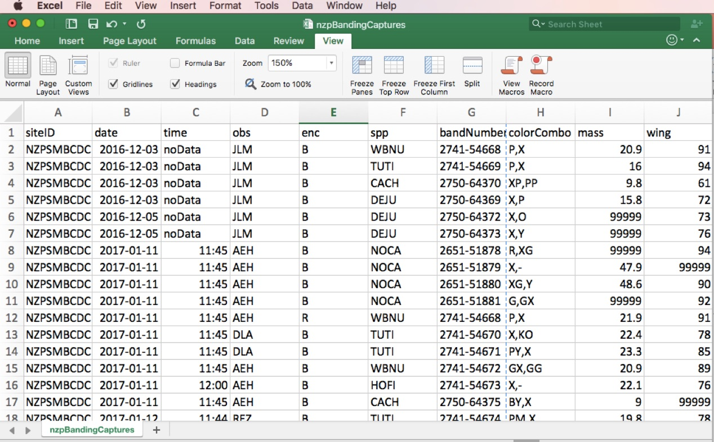
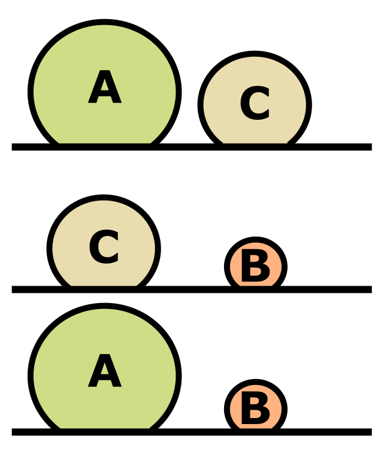

```{r setup, include=FALSE}
knitr::opts_chunk$set(echo = TRUE)
```


```{r include = FALSE}
# Load RCurl library:

library(RCurl)

source("https://raw.githubusercontent.com/bsevansunc/workshop_languageOfR/master/sourceCode.R")

library(knitr) ; library(kableExtra)

options(knitr.table.format = "html")

# Libraries:
library(tidyverse)

# Functions:

theme_add <- function(){
  theme(
    axis.title = element_text(size = rel(1.5))
  )
}

# Preset values

exampleFactor <- factor(c('three','two','one', 'one'))

exampleFactorLevels <- factor(
  exampleFactor,
  levels = c('one', 'two', 'three')
)

exampleFactorLabels <- factor(
  exampleFactorLevels,
  labels = c('One', 'Two', 'Three')
)

numericVector <- c(1, 1, 2, 3, 5, 8)

m <- matrix(numericVector, ncol = 2)

df <-
  as.data.frame(
    m,
    col.names = c('hello', 'world'))


really_bad_date <-
  tibble(
    month = 3,
    day = 10,
    year = 2021)

```

<head>
<link rel="stylesheet" href="https://cdnjs.cloudflare.com/ajax/libs/font-awesome/4.7.0/css/font-awesome.min.css">
<style>
  code{
    background-color:#f2f2f2;
  }
  
  span.co{
    color:#000080;
    font-weight: bold;
  }
  
  img{
	      display: block;
	      padding-left: 15px;
        padding-right: 15px;
        padding-top: 10px;
        padding-bottom: 10px;
  }
  
  .reveal h2{
    text-size: 1.25em;
  }
  
  h2 {
    text-size: 1.25 em;
  }

  p{
    text-align: left;
    font-size: 17px;
  }

  ul, ol{
    line-height: 28px;
    text-align: left;
    font-size: 24px;
    margin-left: 0px;
  }
  
  h2{
    font-size: 36px;
  }
  
  .row{
    margin: auto;
  }
  
  table {
    border-collapse: collapse;
}

table, td, th {
    border: 1px solid black;
    padding: 5px;
    text-align: right;
    vertical-align: middle;
}
  
  /* Create two equal columns that floats next to each other */
.column {
    float: left;
    width: 50%;
    padding: 10px;
}

/* Clear floats after the columns */
.row:after {
    content: "";
    display: table;
    clear: both;
}
</style>
</head>

<h3>In pursuit of normal data (Codd’s rules & tidyr)</h3>
<hr>
<!---p style = "text-align: center; font-size: 24px;">Brian S. Evans, Ph.D.<p/>
Migratory Bird Center<br />
Smithsonian Conservation Biology Institute</p--->
<!-- img style= "display: block; margin-left: auto; margin-right: auto;" src="https://i.pinimg.com/originals/7c/36/05/7c3605f31c371e7ff2021bf55aeb09fa.jpg" width = "90%" title=" Hideta Nagai, National Geographic"/--->

	      
## 
<h3>In pursuit of normal data (Codd’s rules & tidyr)</h3>
<hr>
<p style="text-align: center;">We've been trained to generate untidy data.</p>



## 
<h3>In pursuit of normal data (Codd’s rules & tidyr)</h3>
<hr>
<div class="row">
<div class = "column">
<ul style="line-height: 150%;">
<li><b>Tolstoy</b> (1877): All happy families are alike; each unhappy family is unhappy in its own way.</li>
<br>
<li><b>Wickham</b> (2014):  Tidy datasets are all alike but every messy dataset is messy in its own way.</li>
</ul>
</div>
<div class="column">

</div>
</div>

## 
<h3>In pursuit of normal data (Codd’s rules & tidyr)</h3>
<hr>
<div class="row">
<div class = "column">
<p>All <b>tidy data</b> are:</p>
<ul>
<li>Not platform-specific</li>
<br>
<li>Durable and avoid data entry and modification errors</li>
<br>
<li>Structured in the same way</li>
</ul>
</div>
<div class="column">

</div>
</div>

## 
<h3>In pursuit of normal data (Codd’s rules & tidyr)</h3>
<hr>
<div class="row">
<div class = "column">
<p>We will address <b>tidy data</b> from the perspectives of:</p>
<br>
<ul style="line-height: 150%;">
<li>Data science/engineering</li>
<br>
<li>Statistics (tidyverse)</li>
</ul>
</div>
<div class="column">

</div>
</div>

<!--- before we begin --->

## 
<h3>Before we begin</h3>
<hr>

```{r eval = FALSE}

library(tidyverse)

# Names of files we will use for this lesson:

file_names <-
  c('bird_rawCounts',
    'birdHabits',
    'dfTooLong',
    'wideFrame',
    'untidyFrame')

# Read the files from my GitHub account (a necessary evil, currently):

file_names %>% 
  purrr::map(
    ~ file.path(
      'https://raw.githubusercontent.com/bsevansunc',
      'smsc_data_science/master/data',
      str_c(., '.csv')) %>% 
      read_csv()) %>% 
  set_names(file_names) %>% 
  list2env(envir = .GlobalEnv)

# Remove file_names for a clean global environment:

rm(file_names)
```

## 
<h3>Codd's rules for normal data</h3>
<hr>
<ol>
<li><b>First normal</b>:
<ul>
<li>All rows represent a unique record (primary key)</li>
<li>All values are atomic</li>
<li>Columns do not contain repeated grouping</li>
</ul>
</li>
<br>
<li><b>Second normal</b>: All columns are functionally dependent on the primary key (observation)</li>
<br>
<li><b>Third normal</b>: All columns are non-transitively dependent.
<ul><li>Column values are <b>only</b> directly dependent on the column that defines the observation</ul></li>
</li>
</ol>

##
<h3>Codd's rules: the first normal</h3>
<hr>
<p>All rows represent a unique record (<b>primary key</b>).</p>
<p>The <b>primary key</b> is a data base field that defines a unique record in the database. How does this table violate the first normal?</p>
<br>
<p><i>Note: This rule can typically be used to determine if a single table is correctly structured</i>.</p>

##
<h3>Codd's rules: the first normal</h3>
<hr>
<p>All rows represent a unique record (<b>primary key</b>).</p>
<br>
<div class = "row">
```{r first normal start, echo = FALSE}
kable(messy1NFa, "html") %>%
  kable_styling(
    bootstrap_options = c("striped", "hover"),
    full_width = TRUE,
    font_size = 24,
    position = "float_left"
  )
```
</div>

##
<h3>Codd's rules: the first normal</h3>
<hr>
<p>All rows represent a unique record (<b>primary key</b>).</p>
<br>
<div class = "row">
```{r first normal start2, echo = FALSE}
kable(messy1NFa, "html") %>%
  kable_styling(
    bootstrap_options = c("striped", "hover"),
    full_width = TRUE,
    font_size = 24,
    position = "float_left"
  )
```
</div>
<br>
<div class = "row">
```{r tidy1NFa, echo = FALSE}
kable(tidy1NFa, "html") %>%
  kable_styling(
    bootstrap_options = c("striped", "hover"),
    full_width = FALSE,
    font_size = 24,
    position = "float_left"
  )
```
</div>

##
<h3>Codd's rules: the first normal</h3>
<hr>
<p>All values are atomic.</p>
<p>An <b>atomic value</b> is a value that cannot be divided. How does this table violate the first normal?</p>
<br>
<div class = "row">
```{r badDate, echo = FALSE}
kable(badDate, "html") %>%
  kable_styling(
    bootstrap_options = c("striped", "hover"),
    full_width = FALSE,
    font_size = 24,
    position = "float_left"
  )
```
</div>

##
<h3>Codd's rules: the first normal</h3>
<hr>
<p>All values are atomic.</p>
<div class = "row">
```{r badDate2, echo = FALSE}
kable(badDate, "html") %>%
  kable_styling(
    bootstrap_options = c("striped", "hover"),
    full_width = FALSE,
    font_size = 24,
    position = "float_left"
  )
```
</div>
<br>
<div class = "row">
```{r tidy1NFb0, echo = FALSE}
kable(tidy1NFb0, "html") %>%
 kable_styling(
  bootstrap_options = c("striped", "hover"),
  full_width = FALSE,
  font_size = 24,
  position = "float_left"
  )
```
</div>
<br>
<p><i>Note: This is still not tidy though!</i></p>

##
<h3>Codd's rules: the first normal</h3>
<hr>
<p>Columns do not contain repeated grouping:</p>
<br>
<div class = "row">
```{r messy1NFc, echo = FALSE}
kable(messy1NFc, "html") %>%
 kable_styling(
  bootstrap_options = c("striped", "hover"),
  full_width = FALSE,
  font_size = 16,
  position = "float_left"
  )
```
</div>

##
<h3>Codd's rules: the first normal</h3>
<hr>
<p>Columns do not contain repeated grouping:</p>
<div class = "row">
```{r messy1NFc2, echo = FALSE}
kable(messy1NFc, "html") %>%
 kable_styling(
  bootstrap_options = c("striped", "hover"),
  full_width = FALSE,
  font_size = 24,
  position = "float_left"
  )
```
</div>
<br>
<div class = "row">
```{r tidy1NFc, echo = FALSE}
kable(exampleTidy1, "html") %>%
 kable_styling(
  bootstrap_options = c("striped", "hover"),
  full_width = FALSE,
  font_size = 24,
  position = "float_left"
  )
```
</div>

<!--- second normal --->

##
<h3>The second normal rule</h3>
<hr>
<p>All columns are functionally dependent on the primary key (observation). In other words:</p>
<ul>
<li>All columns are unique to the observation</li>
<li>Every column must be an attribute of the observation that defines the row.</li>
</ul>
<br>
<p><i>Note: The second rule can be typically used to determine if a single table should be split into multiple tables</i>.</p>

##
<h3>The second normal rule</h3>
<hr>
<p>All columns are functionally dependent on the primary key (observation).</p>
<p>How does this table violate the second normal?</p>
<div class = "row">
```{r messy second normal, echo = FALSE}
badBandingRecord <- exampleTidy1 %>%
  mutate(
    site = c('apple','apple', 'avocado', 'apple', 'avocado'),
    canopyCover = c(32.5, 32.5, 78.4, 32.5, 78.4)
  ) %>%
  select(id, birdID, observationDate, site, canopyCover, mass)

kable(badBandingRecord, "html") %>%
 kable_styling(
  bootstrap_options = c("striped", "hover"),
  full_width = FALSE,
  font_size = 24,
  position = "float_left"
  )
```
</div>

##
<h3>The second normal rule</h3>
<hr>
<p>All columns are functionally dependent on the primary key (observation).</p>
<div class = "row">
```{r tidy2NF_obs, echo = FALSE}
siteTable <- badBandingRecord %>%
  select(site, canopyCover) %>%
  distinct %>%
  mutate(id = siteIds) %>%
  select(id, site, canopyCover)

birdObservationTable <- badBandingRecord %>%
  select(-canopyCover) %>%
  left_join(
    siteTable %>%
      rename(siteId = id),
    by  = 'site'
  ) %>%
  select(id, siteId, birdID, observationDate, mass)

kable(birdObservationTable, "html") %>%
 kable_styling(
  bootstrap_options = c("striped", "hover"),
  full_width = FALSE,
  font_size = 24,
  position = "float_left"
  )
```
</div>
<br>
<div class = "row">
```{r tidy2NF_site, echo = FALSE}
kable(siteTable %>% rename(siteId = id), "html") %>%
 kable_styling(
  bootstrap_options = c("striped", "hover"),
  full_width = FALSE,
  font_size = 24,
  position = "float_left"
  )
```
</div>
<p>Is it still in violation?</p>

##
<h3>The second normal rule</h3>
<hr>
<p>All columns are functionally dependent on the primary key (observation).</p>
<div class = "row">
```{r tidy2NFa_obs, echo = FALSE}
visitIds <- vector('character', length = 4)

for(i in seq_along(visitIds)){
  visitIds[i] <- generateObservationID()
}

visitTable <- birdObservationTable %>%
  select(siteId, observationDate) %>%
  distinct %>%
  mutate(id = visitIds) %>%
  select(id, siteId, observationDate)
  
birdObservationTable <- birdObservationTable %>%
  left_join(visitTable %>% rename(visitId = id), by = c('siteId', 'observationDate')) %>%
  select(id, visitId, birdID, mass)

kable(birdObservationTable, "html") %>%
 kable_styling(
  bootstrap_options = c("striped", "hover"),
  full_width = FALSE,
  font_size = 16,
  position = "float_left"
  )
```
</div>
<br>
<div class = "row">
```{r tidy2NFb_visit, echo = FALSE}
visitTable %>% 
  dplyr::rename(date = observationDate) %>%
  kable("html") %>%
  kable_styling(
    bootstrap_options = c("striped", "hover"),
    full_width = FALSE,
    font_size = 16,
    position = "float_left"
  )
```
</div>
<br>
<div class = "row">
```{r tidy2NFb_site, echo = FALSE}
siteTable %>% 
  kable("html") %>%
   kable_styling(
    bootstrap_options = c("striped", "hover"),
    full_width = FALSE,
    font_size = 16,
    position = "float_left")
```
</div>

<!--- the third normal --->
##
<h3>The third normal rule</h3>
<hr>
<p>All columns are non-transitively dependent</p>
<div class = "row">
<div class="column">

</div>
<div class = "column">
<p>William Kent: Every non-key attribute must provide a fact about the key, the whole key, and nothing but the key. So help me Codd.</p>
</div>
</div>

##
<h3>The third normal rule</h3>
<hr>
<p>All columns are non-transitively dependent. How does this table violate the third normal rule?</p>
<div class = "row">
```{r tidy3messy, echo = FALSE}

badYear <- exampleTidy1 %>%
  mutate(observationYear = lubridate::year(observationDate))

badYear %>% 
  select(id, birdID, observationYear, observationDate, mass) %>% 
  kable("html") %>%
 kable_styling(
  bootstrap_options = c("striped", "hover"),
  full_width = FALSE,
  font_size = 24,
  position = "float_left"
  )
```
</div>

##
<h3>The third normal rule</h3>
<hr>
<p>All columns are non-transitively dependent.</p>
<div class = "row">
```{r tidy3messy2, echo = FALSE}

badYear <- exampleTidy1 %>%
  mutate(observationYear = lubridate::year(observationDate))

badYear %>% 
  select(id, birdID, observationYear, observationDate, mass) %>% 
  select(-observationYear) %>% 
  kable("html") %>%
 kable_styling(
  bootstrap_options = c("striped", "hover"),
  full_width = FALSE,
  font_size = 24,
  position = "float_left"
  )
```
</div>
<br>
<div class = "row">
```{r tidy3messy2_fixed, echo = FALSE}

badYear <- exampleTidy1 %>%
  mutate(observationYear = lubridate::year(observationDate))

badYear %>% 
  select(id, birdID, observationYear, observationDate, mass) %>% 
  select(-observationYear) %>% 
  kable("html") %>%
 kable_styling(
  bootstrap_options = c("striped", "hover"),
  full_width = FALSE,
  font_size = 24,
  position = "float_left"
  )
```
</div>
<br>

<!--- onto the tidyverse --->
##
<h2>The rules of tidy data in statistical language</h2>
<hr>
<div class = "row">
<div class = "column" style = "width: 30%">

</div>
<div class = "column" style = "width: 70%">
<br>
<p>Three simple rules:</p>
<ol>
<li>Each variable forms a column</li>
<li>Each observation forms a row</li>
<li>Each level of observation forms a table</li>
</ol>
</div>
</div>

<!--- each variable is a column ---->
##
<h3>Tidy rule: Each variable forms a column</h3>
<hr>
<p>This problem relates to the first normal rule "all values are atomic". You can pull this up in R using the data frame `badDate`.</p>

<div class = "row">
```{r separate0, echo = FALSE}
kable(badDate, "html") %>%
  kable_styling(
    bootstrap_options = c("striped", "hover"),
    full_width = FALSE,
    font_size = 24,
    position = "float_left"
  )
```
</div>

##
<h3>Tidy rule: Each variable forms a column</h3>
<hr>
<p>This rule violation can often be dealt with using the tidyverse `separate` function. Arguments of `separate` include:</p>
<ul>
<li><b>data</b>: The data frame that contains the columns you wish to separate</li>
<li><b>col</b>: The name of the column you wish to separate</li>
<li><b>into</b>: A vector providing the names of the new columns</li>
<li><b>sep</b>: The character that defines where to split the columns</li>
</ul>
```{r separate1, eval = FALSE}
separate(
  data = badDate,
  col = observationDate,
  into = c('date1', 'date2'),
  sep = ", ")
```

##
<h3>Tidy rule: Each variable forms a column</h3>
<hr>
</ul>
```{r eval = TRUE}
separate(
  data = badDate,
  col = observationDate,
  into = c('date1', 'date2'),
  sep = ", ")
```

##
<h3>Tidy rule: Each variable forms a column</h3>
<hr>
<p><b>Untidy problem</b>: Variable split into multiple columns</p>
<br>
<p>This rule can also be violated in the other direction, when a single variable is split into multiple columns. A common example of this is with dates (`really_bad_date`):</p>

```{r echo = FALSE}
kable(really_bad_date, "html") %>%
  kable_styling(
    bootstrap_options = c("striped", "hover"),
    full_width = FALSE,
    font_size = 24,
    position = "float_left"
  )
```

##
<h3>Tidy rule: Each variable forms a column</h3>
<hr>
<p><b>Untidy problem</b>: Variable split into multiple columns</p>
<br>
<p>We can use the `unite` function to address this:</p>

```{r eval = FALSE}
unite(
  data = really_bad_date, 
  col = 'date', 
  c(year, month, day), 
  sep = '-')
```

##
<h3>Tidy rule: Each variable forms a column</h3>
<hr>

```{r eval = TRUE}
unite(
  data = really_bad_date, 
  col = 'date', 
  c(year, month, day), 
  sep = '-')
```

##
<h3>Tidy rule: Each variable forms a column</h3>
<hr>
<p><b>Untidy problem</b>: Transitive columns</p>
<br>
<p>Here we meet Codd's third rule for normal data. The data below are R in the data frame named `badYear`. These columns are called <b>transitive</b> because year can be derived from date.</p> 
<div class = "row">
```{r badYear, echo = FALSE}
kable(badYear, "html") %>%
  kable_styling(
    bootstrap_options = c("striped", "hover"),
    full_width = FALSE,
    font_size = 24,
    position = "float_left"
  )
```
</div>
<br>

##
<h3>Tidy rule: Each variable forms a column</h3>
<hr>
<p><b>Untidy problem</b>: Transitive columns</p>
<br>
<p>Obviously, we have to remove the year column. Previously, we did this using indexing:</p> 

<div class = "row">
```{r eval = FALSE}

# By position: 

badYear[,1:4]

badYear[,-5]

# By name:

badYear[, c('id', 'birdID', 'observationDate', 'mass')]

```
</div>

##
<h3>Tidy rule: Each variable forms a column</h3>
<hr>
<p><b>Untidy problem</b>: Transitive columns</p>
<br>
<p>Obviously, we have to remove the year column. Previously, we did this using indexing:</p> 

<div class = "row">
```{r eval = FALSE}

# By position: 

badYear[,1:4]

badYear[,-5]

# By name:

badYear[, c('id', 'birdID', 'observationDate', 'mass')]

```
</div>

##
<h3>Tidy rule: Each variable forms a column</h3>
<hr>
<p><b>Untidy problem</b>: Transitive columns</p>
<br>
<p>This rule violation can be dealt with using the tidyverse `select` function:</p>

```{r eval = FALSE}

# By position: 

select(badYear, 1:4)

select(badYear, -5)

# By name:

select(badYear, id:mass)

select(badYear, -observationYear)

```

<!--- Each observation forms a row --->
##
<h3>Tidy rule: Each observation forms a row</h3>
<hr>
<p><b>Untidy problem</b>: Multiple observations in a row (i.e., more than one observation per row).</p>
<br>
<p>This is a violation  of Codd's first rule. Take a look at the dataset `untidyFrame`:</p>
<div class = "row">
```{r untidyFrameTable, echo = FALSE}
kable(untidyFrame, "html") %>%
 kable_styling(
  bootstrap_options = c("striped", "hover"),
  full_width = FALSE,
  font_size = 24,
  position = "float_left"
  )
```
</div>

##
<h3>Tidy rule: Each observation forms a row</h3>
<hr>
<p><b>Untidy problem</b>: Multiple observations in a row (i.e., more than one observation per row).</p>
<br>
<p>We can address this using the tidyverse function `pivot_longer`:</p>
<div class = "row">
```{r eval = FALSE}
pivot_longer(
  data = untidyFrame,
  cols = treatmentA:treatmentB,
  names_to = 'treatment',
  names_prefix = 'treatment',
  values_to = 'value')
```

##
<h3>Tidy rule: Each observation forms a row</h3>
<hr>
<div class = "row">
```{r eval = TRUE}
pivot_longer(
  data = untidyFrame,
  cols = treatmentA:treatmentB,
  names_to = 'treatment',
  names_prefix = 'treatment',
  values_to = 'value')
```

##
<h3>Tidy rule: Each observation forms a row</h3>
<hr>
<p><b>Untidy problem</b>: Multiple rows per observation.</p>
<br>
<p>Are all tidy data frames long? Not necessarily! It depends on the observational unit of your study.</p>
<p>Consider the following data frame of bird measurement data that we used in the first section (`dfTooLong`):</p>

<div class = "row">
```{r untidy HW2a, echo = FALSE, warning = FALSE}
kable(dfTooLong, "html") %>%
  kable_styling(
  bootstrap_options = c("striped", "hover"),
  full_width = FALSE,
  font_size = 24,
  position = "float_left"
  )
```
</div>

##
<h3>Tidy rule: Each observation forms a row</h3>
<hr>
<p><b>Untidy problem</b>: Multiple rows per observation.</p>
<br>
<p>We can address this using the tidyverse function `pivot_wider`:</p>

<div class = "row">
```{r eval = FALSE}
pivot_wider(
  data = dfTooLong,
  names_from = measurement,
  values_from = value)
```
</div>

##
<h3>Tidy rule: Each observation forms a row</h3>
<hr>

<div class = "row">
```{r eval}
pivot_wider(
  data = dfTooLong,
  names_from = measurement,
  values_from = value)
```
</div>

##
<h3>Tidy rule: Each level of observation forms a table</h3>
<hr>
<p><b>Untidy problem</b>: Multiple levels of observation in a table (second normal).</p>

<p>A single table is contains data collected across multiple observational levels. Here's our `badBandingRecord`:</p>

<div class = "row">
```{r badBandingRecordTable, echo = FALSE, warning = FALSE}
kable(badBandingRecord, "html") %>%
  kable_styling(
  bootstrap_options = c("striped", "hover"),
  full_width = FALSE,
  font_size = 24,
  position = "float_left"
  )
```
</div>

##
<h3>Tidy rule: Each level of observation forms a table</h3>
<hr>
<p>This table above contains:</p>
<ul>
<li>Site-level observations: Canopy cover is an attribute of the site</li>
<li>Bird-level observations: birdID, observationDate, site, and mass are all attributes of a bird's capture event</li>
</ul>
<br>
<br>
<div class = "row">
```{r badBandingRecordTable2, echo = FALSE, warning = FALSE}
kable(badBandingRecord, "html") %>%
  kable_styling(
  bootstrap_options = c("striped", "hover"),
  full_width = FALSE,
  font_size = 24,
  position = "float_left"
  )
```
</div>

##
<h3>Tidy rule: Each level of observation forms a table</h3>
<hr>
<p>Use `select` to restructure the banding record into a list with two normalized tibbles:</p>

```{r eval = FALSE}
list(
  birds = 
    select(
      badBandingRecord,
      birdID,
      observationDate,
      site,
      mass),
  sites =  
    select(
      badBandingRecord,
      site,
    canopyCover))
```

##
<h3>Tidy rule: Each level of observation forms a table</h3>
<hr>

```{r echo = FALSE}
list(
  birds = 
    select(
      badBandingRecord,
      birdID,
      observationDate,
      site,
      mass),
  sites =  
    select(
      badBandingRecord,
      site,
    canopyCover))
```

<p>We've got duplicate information!</p>

##
<h3>Tidy rule: Each level of observation forms a table</h3>
<hr>
<p>Remove the duplicate rows with `distinct`:</p>

```{r eval = FALSE}
bird_list <-
  list(
    birds = 
      select(
        badBandingRecord,
        birdID,
        observationDate,
        site,
        mass),
    sites =  
      select(
        badBandingRecord,
        site,
        canopyCover))

bird_list[[2]] <- distinct(bird_list[[2]])
```
<p>That code is super ugly, but we'll soon find a way around it!</p>


##
<h3>Tidy rule: Each level of observation forms a table</h3>
<hr>
<p>Remove the duplicate rows with `distinct`:</p>

```{r echo = FALSE}
bird_list <-
  list(
    birds = 
      select(
        badBandingRecord,
        birdID,
        observationDate,
        site,
        mass),
    sites =  
      select(
        badBandingRecord,
        site,
        canopyCover))

bird_list[[2]] <- distinct(bird_list[[2]])

bird_list
```

##
<h3>Next up</h3>
<hr>
<p>Working with tidy data!</p>


