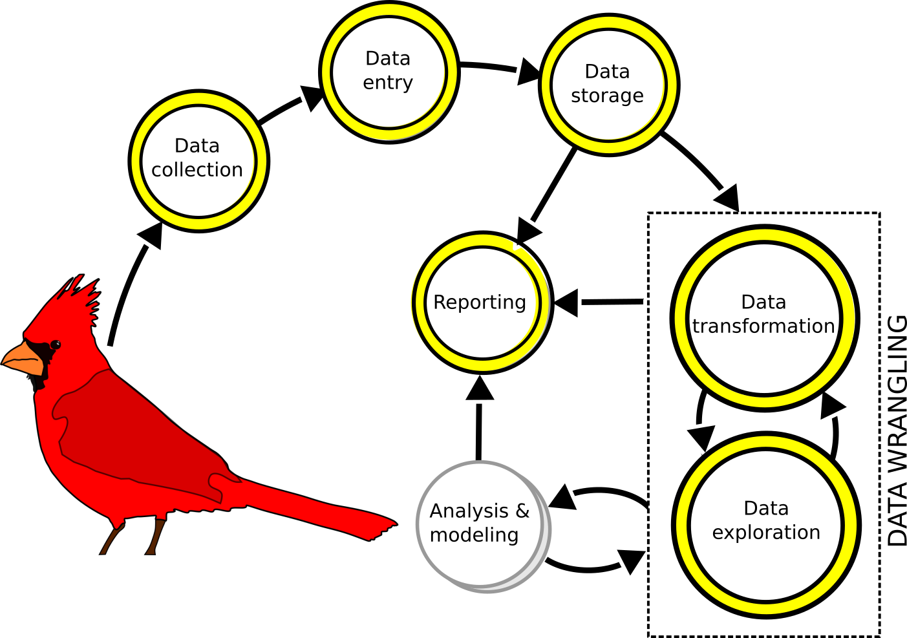

---
output:
  revealjs::revealjs_presentation:
    theme: simple
    highlight: pygments
    center: false
    transition: none
    progress: true
    font-family: Verdana
---

```{r include = FALSE}
# Libraries:
library(tidyverse)

# Functions:

theme_add <- function(){
  theme(
    axis.title = element_text(size = rel(1.5))
  )
}

# Preset values

exampleFactor <- factor(c('three','two','one', 'one'))

exampleFactorLevels <- factor(
  exampleFactor,
  levels = c('one', 'two', 'three')
)

exampleFactorLabels <- factor(
  exampleFactorLevels,
  labels = c('One', 'Two', 'Three')
)

numericVector <- c(1, 1, 2, 3, 5, 8)

m <- matrix(numericVector, ncol = 2)

df <-
  as.data.frame(
    m,
    col.names = c('hello', 'world'))

```

<head>
<style>
  code{
    background-color:#f2f2f2;
  }
  
  span.co{
    color:#000080;
    font-weight: bold;
  }
  
  img{
	      display: block;
	      padding-left: 15px;
        padding-right: 15px;
        padding-top: 10px;
        padding-bottom: 10px;
  }

  p{
    text-align: left;
    font-size: 18px;
  }

  ul, ol{
    line-height: 28px;
    text-align: left;
    font-size: 24px;
    margin-left: 0px;
  }
  
  h2{
    font-size: 36px;
  }
  
  .row{
    margin: auto;
  }
  
  table {
    border-collapse: collapse;
}

table, td, th {
    border: 1px solid black;
    padding: 5px;
    text-align: right;
    vertical-align: middle;
}
  
  /* Create two equal columns that floats next to each other */
.column {
    float: left;
    width: 50%;
    padding: 10px;
}

/* Clear floats after the columns */
.row:after {
    content: "";
    display: table;
    clear: both;
}
</style>
</head>

<h2>Introduction to data science in R</h2>
<hr>
<p style = "text-align: center; font-size: 24px;">Brian S. Evans, Ph.D.<p/>
Migratory Bird Center<br />
Smithsonian Conservation Biology Institute</p>
<br>

 
## Data science workflow
<hr>

	      
## Data science workflow
<hr>

	      
## Data science workflow
<hr>

	      
## Re-thinking data
<hr>
<p style="text-align: center;">How we've interacted with data dictates how we structure data mentally.</p>


	      
## Workshop goals
<hr>
<ul style="line-height: 150%;">
<li>Today: Workshop overview and logic</li>
<li>In pursuit of normal data (Codd’s rules & tidyr)</li>
<li>Data visualization (ggplot)</li>
<li>Functions and how to avoid them (dplyr)</li>
<li>For loops and how to avoid them (purrr)</li>
<li>Redefining normal: Nested datasets (purrr)</li>
<li>Applications: Introduction to geospatial analysis with R (sf)</li>
<li>Introduction to data reporting (RMarkdown & Shiny)</li>
</ul>


## Today's goals
<hr>
<div class="row">
<div class = "column">
<ul style="line-height: 150%;">
<li>RStudio</li>
<li>Best practices in coding</li>
<li>Logic
<ul>
<li><b>Objects</b>: Container for holding values</li>
<li><b>Indexing</b>: Querying objects by position</li>
<li><b>Logic</b>: Querying objects using logical operators
</ul></li>
</ul>
</div>
<div class="column">

</div>
</div>


## RStudio
<hr>


## Best practices - A few starting points
<hr>

<ul style="line-height: 150%;">
<li>Always work in a project! Avoiding `setwd()` or long references to points on your computer</li>
```{r eval = FALSE}
/Users/brianevans/gits/smbc-nzp.github.io/www/kml.jpg
```
<li>Using `source` to stop rebuilding the wheel (<a style = "color: red;">danger</a>)</li>
<li>Avoiding package proliferation</li>
<li>Use keyboard shortcuts!
<ul>
<li>Shortcut help: option(alt)-shift-k</li>
<li>Running code! cmd(ctrl)-return(enter)</li>
</ul>
</li>
</ul>

## Best practices - Communicating code
<hr>
<ul style="line-height: 150%;">
<li>Sectioning: cmd-shift-r</li>
<li>Commenting code</li>
<li>Formatting code chunks</li>
<li>Reading and writing data</li>
<li>Version control (Github)</li>
</ul>


## Querying data
<hr>
<ul>
<li>Using logic with objects</li>
<li>The logical operators to compare <b>values</b> and <b>sets</b></li>
<li>Indexing and logic:
<ul>
<li>Querying <b>vectors</b>, <b>matrices</b>, and <b>data frames</b></li>
<li>Working with <b>strings</b></li>
<li>Summarizing and queries</li>
</ul></li>
<li>Practice with real data</li>
</ul>

## Review: Indexing vectors
<hr>
<p>Each value in a vector has a position, denoted by "[<i>x</i>]"</p>

<table style = "font-size: 1em; vertical-align: middle;">
<tr>
  <th style = "text-align: center; font-weight: normal;">[1]</th>
  <th style = "text-align: center; font-weight: normal;">[2]</th>
  <th style = "text-align: center; font-weight: normal;">[3]</th>
  <th style = "text-align: center; font-weight: normal;">[4]</th>
</tr>
<tr>
  <td style = "text-align: center;">1</td>
  <td style = "text-align: center;">1</td>
  <td style = "text-align: center;">2</td>
  <td style = "text-align: center;">3</td>
</tr>
</table>

```{r eval = FALSE}
# Use indexing to subset a vector:

numericVector <-
  c(1, 1, 2, 3, 5, 8)  

numericVector[3]

numericVector[3:4]

numericVector[c(1,3)]
```

## Review: Indexing matrices
<hr>
<p>A <b>matrix</b> is a two dimensional object -- basically a vector that has been positioned as multiple columns. All values must be of the same class.</p>

```{r eval = TRUE}
# Generate matrix using the numeric vector:

m <- 
  matrix(
    numericVector,
    ncol = 2)

m
```

## Matrix objects: Indexing
<hr>
<p>Values in a matrix have a row (x) and column (y) position, denoted by "[<i>x</i>, <i>y</i>]"</p>
<table style = "font-size: 1.1em; vertical-align: middle;">
<tr>
  <th style = "text-align: center; font-weight: normal;"></th>
  <th style = "text-align: center; font-weight: normal;">[ ,1]</th>
  <th style = "text-align: center; font-weight: normal;">[ ,2]</th>
</tr>
<tr>
  <td style = "text-align: center;">[1, ]</td>
  <td style = "text-align: center;">1</td>
  <td style = "text-align: center;">3</td>
</tr>
<tr>
  <td style = "text-align: center;">[2, ]</td>
  <td style = "text-align: center;">1</td>
  <td style = "text-align: center;">5</td>
</tr>
<tr>
  <td style = "text-align: center;">[3, ]</td>
  <td style = "text-align: center;">2</td>
  <td style = "text-align: center;">8</td>
</tr>
</table>

## Matrix objects: Indexing
<hr>
<p>Values in a matrix have a row (x) and column (y) position, denoted by "[<i>x</i>, <i>y</i>]"</p>
```{r eval = TRUE}
# Index by row (x) and column (y) position [x,y]:

m

m[ ,1]
```

## Matrix objects: Indexing
<hr>
<p>Values in a matrix have a row (x) and column (y) position, denoted by "[<i>x</i>, <i>y</i>]"</p>
```{r eval = TRUE}
# Index by row (x) and column (y) position [x,y]:

m

m[2, ]

```

## Matrix objects: Indexing
<hr>
<p>Values in a matrix have a row (x) and column (y) position, denoted by "[<i>x</i>, <i>y</i>]"</p>
```{r eval = TRUE}
# Index by row (x) and column (y) position [x,y]:

m

m[1:2, 1]

```

## Matrix objects: Indexing
<hr>
<p>Values in a matrix have a row (x) and column (y) position, denoted by "[<i>x</i>, <i>y</i>]"</p>
```{r eval = TRUE}
# Index by row (x) and column (y) position [x,y]:

m

m[c(1, 3), 1]

```

## Data frame objects: Indexing
<hr>
<p>Because data frames are shaped like matrices, they too can be indexed by their row (x) and column (y) position, denoted by "[<i>x</i>, <i>y</i>]"</p>

```{r eval = TRUE}
# Generate data frame:

df <-
  as.data.frame(m)

names(df) <- c('hello', 'world')

df
```

## Data frame objects: Indexing
<hr>
<p>Because data frames are shaped like matrices, they too can be indexed by their row (x) and column (y) position, denoted by "[<i>x</i>, <i>y</i>]"</p>

```{r eval = TRUE}
# Index by row (x) and column (y) position [x,y]:

df

df[1:2, 2]
```

## Data frame objects: Indexing
<hr>
<p>Because data frames have a names attribute, you can also index using their column (or row) names.</p>

```{r eval = TRUE}
# Index by row (x) position and column name [x, 'name']:

df

df[1:2, 'world']
```

## Review: logical values
<hr>
<br>
<div style = "text-align: left;">
<p> R reserves the words TRUE and FALSE as logical constants. These constants are mapped to integer values:</p>
<ul>
<li><b>FALSE</b>: 0</li>
<li><b>TRUE</b>: 1</li>
</ul>
</div>

## Review: logical values
<hr>

```{r is equal to, eval = FALSE}
# The "is equal to" logical operator:

3 == 3

3 == 4

3 == 2 + 1

3 == 3 + 1

(3 == 3) + (3 == 2 + 1)
```

## Using logic with objects
<hr>
<p>Logical tests can be run on sets of values.</p>
```{r logic with objects vector, eval = TRUE}

numericVector

# Evaluate whether values in numericVector are equal to 3:

numericVector == 3

```

## Using logic with objects
<hr>
<p>Logical tests can be run on sets of values.</p>
```{r logic with objects vector2, eval = TRUE}
numericVector

# Evaluate whether values in numericVector are equal to 1:

numericVector == 1

```

## Using logic with objects
<hr>
<p>Logical tests can be run on sets of values.</p>
```{r logic with objects matrix, eval = TRUE}
# Evaluate whether values in matrix m are equal to 3:

m

m == 3
```

## Using logic with objects
<hr>
<p>Logical tests can be run on sets of values.</p>
```{r logic with objects data frame, eval = TRUE}
# Evaluate whether values in data frame df are equal to 3:

df

df == 3
```

## Logical operators
<hr>
<br>
<table>
<tr>
  <th><b>Operator</b></th>
  <th><b>Description</b></th>
  <th><b>Value class</b></th>
</tr>
<tr>
  <td>x == y</td>
  <td>x is equal to y</td>
  <td>any</td>
</tr>
<tr>
  <td>x != y</td>
  <td>x is NOT equal to y</td>
  <td>any</td>
</tr>
<tr>
  <td>!x</td>
  <td>NOT x</td>
  <td>any</td>
</tr>
<tr>
  <td>x < y</td>
  <td>x is less than y</td>
  <td>numbers</td>
</tr>
<tr>
  <td>x <= y</td>
  <td>x is less than or equal to y</td>
  <td>numbers</td>
</tr>
<tr>
  <td>x > y</td>
  <td>x is greater than y</td>
  <td>numbers</td>
</tr>
<tr>
  <td>x >= y</td>
  <td>x is greater than or equal to y</td>
  <td>numbers</td>
</tr>
</table>

## Logic: Comparing values
<hr>

```{r explore logical operators with v, eval = FALSE}

# Explore logical operators in a vector:

numericVector

numericVector != 3

!(numericVector == 3)

numericVector < 3

numericVector <= 3

numericVector > 3

numericVector >= 3

```
<p>Repeat the above with your matrix, `m`, and data frame, `df`.</p>

## Logic: Comparing sets
<hr>
<p>The operator `%in%` tests the logic statement "is in".</p>

```{r using in, eval = TRUE}
# Test whether values in numericVector match values 1 or 3:

numericVector

numericVector %in% c(1,3)

```

## Logic: Comparing sets
<hr>
<p>The NOT statement, `!x`, in combination with `%in%`, is a powerful tool to examine sets.</p>

```{r using in and not, eval = TRUE}
# Test whether values in numericVector DO NOT match values 1 or 3:

numericVector

!(numericVector %in% c(1,3))

```


## Logic: Comparing sets

<hr>
<p>You can also compare sets with <i>and/or</i> statements, represented in R by `&` and `|`.</p>

```{r using and or, eval = TRUE}
# Test whether values in v match values 1 OR 3:

numericVector

numericVector == 1 | numericVector == 3

```

## Logic: Comparing sets

<hr>
<p>You can also compare sets with <i>and/or</i> statements, represented in R by `&` and `|`.</p>

```{r using and or2, eval = TRUE}
# Test whether values in v match values 1 AND 3:

numericVector

numericVector == 1 & numericVector == 3

```

## Logic: Comparing sets
<hr>
<p>The AND operator is very useful when querying across multiple conditions.</p>

```{r better use of and, eval = TRUE}
# Test whether values in v are less than 5 and not equal to 2:

numericVector

numericVector < 5 & numericVector != 2

```

## Indexing & logic: Vectors
<hr>
<p>Recall that the position of value `x` in vector `v` is notated as `v[x]`</p>
```{r vector index review, eval = TRUE}
# Use indexing to subset a vector:

numericVector

numericVector[3]
```

## Indexing & logic: Vectors
<hr>
<p>You may also query values by <b>condition</b>, using logic, in the same manner as above.</p> 
<p>For example, vector `v` where value v<sub>x</sub> is greater than two:</p>

```{r logic query with which, eval = TRUE}
# At which indices does our logical statement evaluate to TRUE?

numericVector

numericVector > 2

```

## Indexing & logic: Vectors
<hr>
<p>You may also query values by <b>condition</b>, using logic, in the same manner as above.</p> 
<p>For example, vector `v` where value v<sub>x</sub> is greater than two:</p>

```{r logic query with which2, eval = TRUE}
# At which indices does our logical statement evaluate to TRUE?

which(numericVector > 2)

numericVector[4:6]

```

## Indexing & logic: Vectors
<hr>
<p>You may also query values by <b>condition</b>, using logic, in the same manner as above.</p> 
<p>For example, vector `v` where value v<sub>x</sub> is greater than two:</p>

```{r logic query with which3, eval = TRUE}
# At which indices does our logical statement evaluate to TRUE?

numericVector[4:6]

numericVector[which(numericVector > 2)]
```

## Indexing & logic: Vectors
<hr>
<p>You may also query values by <b>condition</b>, using logic, in the same manner as above.</p> 
<p>For example, vector `v` where value v<sub>x</sub> is greater than two:</p>

```{r logic query with which4, eval = TRUE}
# At which indices does our logical statement evaluate to TRUE?

numericVector[which(numericVector > 2)]

numericVector[numericVector > 2]
```

## Indexing & logic: Vectors
<hr>
<p>Take a moment to query vector `v` based on the following conditions:</p>
<br>
<ul>
<li>Values greater than or equal to 3</li>
<li>Values that do not equal 2</li>
<li>Values that equal 2</li>
<li>Values greater than or equal to 3 but do not equal 5</li>
<li>Values that are 3 or 5</li>
</ul>

## Indexing & logic: Matrices
<hr>
<p>Recall that the position of value `x,y` (row, column) in a matrix, `m`, can be notated as `m[x,y]`.</p>

```{r matrix index, eval = FALSE}
# Index matrix m by row (x) and column (y) position [x,y]:

m

m[,]

m[1,1]

m[2,2]

m[2, ]

m[ ,2]

m[1:2,2]

```

## Indexing & logic: Matrices
<hr>
<p>Matrix queries are fundamentally the same as vector queries:</p>

```{r m just logic, eval = TRUE}
# Logical test of whether the first column of m is greater than 1:

m

m[,1] > 1

```

## Indexing & logic: Matrices
<hr>
<p>Matrix queries are fundamentally the same as vector queries:</p>

```{r m just logic2, eval = TRUE}
# At which indices does our logical statement evaluate to TRUE?

m

which(m[,1] > 1)

```

## Indexing & logic: Matrices
<hr>
<p>Matrix queries are fundamentally the same as vector queries:</p>

```{r m just logic3, eval = TRUE}
# At which indices does our logical statement evaluate to TRUE?

which(m[,1] > 1)

# Query m by index:

m[3, ]

```

## Indexing & logic: Matrices
<hr>
<p>Matrix queries are fundamentally the same as vector queries:</p>

```{r m just logic4, eval = TRUE}
# At which indices does our logical statement evaluate to TRUE?

which(m[,1] > 1)

# Subset m by logical statement:

m[which(m[,1] > 1), ]

```

## Indexing & logic: Matrices
<hr>
<p>Matrix queries are fundamentally the same as vector queries:</p>

```{r m just logic5, eval = TRUE}
# At which indices does our logical statement evaluate to TRUE?

which(m[,1] > 1)

# Subset m by ogical statement:

m[m[,1] > 1, ]

```


## Indexing & logic: Matrices
<hr>
<p>Matrix queries using "matrix notation" can be challenging:</p>

```{r m query complicated, eval = TRUE}
# Querying matrix by column 1 less than 2 and column 2 less than 5
m

which(m[,1] < 2 &  m[,2] < 5)

```

## Indexing & logic: Matrices
<hr>
<p>Matrix queries using "matrix notation" can be challenging:</p>

```{r m query complicated2, eval = TRUE}
# Querying matrix by column 1 less than 2 and column 2 less than 5
m

m[m[,1] < 2 &  m[,2] < 5 , ]

```

## Indexing & logic: Data frames
<hr>
<p>The position of value `x,y` (row, column) in a data frame, `df`, can be notated as `df[x,y]`.</p>

```{r data frame index, eval = FALSE}
# Index data frame df by row (x) and column (y) position [x,y]:

df[,]

df[1,1]

df[2,2]

df[2, ]

df[ ,2]

df[1:2,2]

```

## Indexing & logic: Data frames
<hr>
<p>Recall ...</p>

```{r data frame reset names 2, eval = FALSE}
# Data frame indexing by position ...

df[,1]

df[,2]

# ... is equivalent to:

df$hello

df$world
```

## Indexing & logic: Data frames
<hr>
<p>Thus ...</p>

```{r data frame query by position and name, eval = FALSE}

# Querying data frames using "matrix notation" ...

df[,1] > 1

which(df[,1] > 1)

df[df[,1] > 1,]

# ... is equivalent to using column names:

df$hello > 1

which(df$hello > 1)

df[df$hello > 1,]

```

## Indexing & logic: Data frames
<hr>
<br>
<p>Now you: Query  `df` such that values of column one are less than 2 and values of column two are less than 5. Use "matrix notation" and the column names of `df` to do so.</p>
<br>
